# Architecture

Submarine Explorer renders **real ocean-floor bathymetry** from the GMRT
synthesis as a navigable 3D world, with scan-and-discover missions on top.
There are three parts that meet at documented interfaces:

1. an **offline Python pipeline** (`tools/`) that downloads bathymetry and
   writes tiles,
2. **content packs** (`data/landmarks.json`, `data/landmarks/<id>/`): JSON that
   places POIs, props, field-guide text and missions on a tile, and
3. a **browser engine** (`src/`) that loads both and simulates a submarine.

The pipeline/engine interface is the tile format —
[`docs/tile-format.md`](./tile-format.md). The content schemas are in
[`plan/PHASE-B-CONTRACTS.md`](../plan/PHASE-B-CONTRACTS.md) §2. Neither the
pipeline nor the content knows anything else about the engine.

## Module diagram

Phase C integration (2026-09-22): `ui/Globe.ts` and `GlobeModel.ts` provide
the globe picker (`N` / `?globe=1`) and the field guide has an OBIS species
tab through `game/Species.ts`. `world/presets/Presets.ts` now selects and
enters an environment after props/POIs load. Its per-frame update follows
`Atmosphere.update`, before fog, headlights, snow and post-processing consume
the sample. Current coupling receives zero simulated time while the briefing
or globe freezes the game. `window.__game.presets` exposes selection, entry
state, current and debug statistics. `world/Currents.ts` loads the offline
HYCOM grid for each tile; `window.__game.currents` exposes its load status.
The gameplay current setting scales or disables both that field and preset
force. See [presets.md](./presets.md) and [currents.md](./currents.md).

Public data and asset defaults resolve through `util/publicUrl.ts` using
Vite's deployment base. Explicit loader roots retain their caller-provided
meaning. See [deploy.md](./deploy.md) for the project-base browser check.
C5 is now wired end to end: `core/Save.ts` persists `subexplorer.settings.v1`
(graphics tier, post-fx, terrain detail, default sim speed, reduce-motion,
captions, sonar palette), `ui/Settings.ts` is the `O` screen that reads and
writes it, and `ui/Captions.ts` renders the on-screen caption
line from `AudioSystem`'s `CaptionBus` (sonar ping/echo, scan chimes). See
[settings.md](./settings.md) and [audio.md](./audio.md).

```mermaid
flowchart TD
  subgraph pipeline["Offline pipeline (Python 3.9, stdlib only)"]
    GMRT[("GMRT GridServer\nESRI ASCII")]
    ETOPO[("ETOPO 2022 via ERDDAP\nfallback")]
    CACHE[(".cache/gmrt-raw/\n(gitignored)")]
    FA["tools/fetch_all.py\nTier-2 batch: plan, probe, retry"]
    FT["tools/fetch_tile.py"]
    EA["tools/esri_ascii.py\nparse + NODATA fill"]
    TW["tools/tile_writer.py\nmeta + float32 + index"]
    CT["tools/compress_tiles.py\n.gz / .br / heightmap16.bin"]
    MS["tools/make_synthetic_tile.py"]
    IT["tools/inspect_tile.py"]
    VP["tools/validate_props.py"]
    GMRT --> FA
    ETOPO -.-> FA
    FA <--> CACHE
    FA --> FT
    GMRT --> FT --> EA --> TW
    MS --> TW
    TW --> DISK
    DISK --> CT --> DISK
    DISK --> IT
  end

  DISK[("data/tiles/&lt;id&gt;/\nmeta.json, heightmap.bin, heightmap16.bin\ndata/tiles/index.json")]
  LM[("data/landmarks.json")]
  PACK[("data/landmarks/&lt;id&gt;/\nmission, pois, guide, props\ndata/landmarks/index.json")]
  GLB[("public/assets/models/*.glb\npublic/assets/decoders/draco/")]
  PACK --> VP

  subgraph engine["Browser engine (TypeScript + Three.js)"]
    MAIN["main.ts\nbootstrap + frame loop"]

    subgraph core["core/"]
      TIME["Time\n60 Hz accumulator"]
      INPUT["Input\naction map, keyboard / mouse / gamepad"]
      BUS["EventBus\ntyped GameEvents"]
      CFG["Config\nall tuning constants"]
      SAVE["Save (C5)\nsettings persistence, localStorage v1"]
    end

    subgraph world["world/"]
      TL["TileLoader\nfetch + validate + decode"]
      TER["Terrain / TerrainChunk / TerrainNoise / TerrainMaterial\nchunks, detail, LOD, sampleHeight"]
      WAT["Water\nsurface lid"]
      LMK["Landmarks\nmarkers + labels"]
      PROPS["Props + PropLoader\nplacement, LOD/impostor, collide()"]
      PSUB["props/\nProcedural, Collision, Wiring, PlacementDebug"]
      PRE["presets/ (C3)\nPresetSystem + vent/brine/canyon/reef/\ntrench/wreck/seamount/default"]
    end

    subgraph render["render/"]
      ATM["Atmosphere\ndepth bands, fog, lights, caustics"]
      HL["Headlights"]
      SNOW["MarineSnow"]
    end

    subgraph game["game/"]
      CP["ContentPath"]
      POI["Pois / Guide"]
      SCAN["Scanner"]
      DS["DiscoveryStore\nlocalStorage v1"]
      OBJ["Objectives + SessionStats"]
      DISC["Discovery\nwires scan, guide, debrief"]
      MIS["Mission\nmanifest + state machine"]
      MR["MissionRouter\n?mission=, loadout, nav"]
      SPEC["Species (C4)\nloads species.json for the guide's SPECIES tab"]
    end

    subgraph sub["sub/"]
      PHY["Submarine\narcade physics, hull stress, crush"]
      SM["SubMesh\nprocedural placeholder hull"]
      CAM["CameraRig\nchase / first-person / orbit"]
    end

    subgraph audio["audio/"]
      AUD["AudioSystem\nengine, sonar echo, beds, cues"]
    end

    subgraph ui["ui/ (DOM overlays)"]
      HUD["HUD"]
      SON["Sonar (2D canvas)"]
      MSEL["MissionSelect"]
      SO["ScanOverlay"]
      FG["FieldGuide"]
      DB["Debrief"]
      BR["Briefing"]
      OP["ObjectivesPanel"]
      GL["Globe + GlobeModel (C1)\nN / ?globe=1 dive-site picker"]
      SET["Settings (C5)\nO screen: tier, postFx, captions, bindings"]
      CAPT["Captions (C5)\nrenders AudioSystem's CaptionBus"]
    end

    SHD["shaders/underwater.ts\nfull-screen post pass"]
    GEO["util/geo.ts\nlat/lon <-> world metres"]
  end

  DISK --> TL --> TER
  LM --> LMK
  PACK --> CP
  CP --> POI & PROPS & MIS
  GLB --> PROPS
  PROPS --> PSUB
  MAIN --> TIME & INPUT & CFG
  TER --> PHY & SON & LMK & PROPS & CAM & AUD & DISC
  PSUB --> PHY
  PHY --> CAM & HUD & SON & SM
  POI --> DISC
  SCAN & DS & OBJ --> DISC
  DISC --> SO & FG & DB
  MR --> MIS
  MR --> BR & OP & DB
  MR --> DISC
  ATM --> SHD
  GEO --> TER & HUD & LMK & POI & PROPS & MR
  BUS -.-> AUD & DISC & MIS & MR & ATM
  TER & PACK & DISC --> PRE
  PRE --> ATM
  LM --> GL
  CP --> SPEC --> FG
  MAIN --> SAVE --> SET
  AUD --> CAPT
```



Solid arrows are construction-time dependencies or per-frame data; dashed
arrows are EventBus traffic. `Submarine` depends only on the narrow
`HeightField` interface, and props reach it through `PropContact`
(`world/props/Wiring.ts`), not by import.

## Data flow

**Build a tile (offline, once per dive site).**
`fetch_tile.py` probes the GMRT metadata endpoint for the grid size, applies the
4M-cell guard, downloads ESRI ASCII, parses it, fills NODATA, and writes
`heightmap.bin` + `meta.json` + a refreshed `index.json`. `fetch_all.py` does
this for every Tier-2 landmark: it plans the bbox from `data/landmarks.json`,
picks the finest resolution under 8 MB / 1500 cells a side, caches raw
responses in `.cache/gmrt-raw/`, retries with backoff and falls back to ETOPO.
`compress_tiles.py` then writes `.gz` (and `.br` when the CLI exists) and, with
`--quant16`, `heightmap16.bin` + the `quant_*` meta keys. See
[`docs/tiles-inventory.md`](./tiles-inventory.md).

**Boot (per page load, `main.ts`).**

1. In parallel: `TileLoader.loadIndex()` and `resolveMissionRoute(params)`
   (fetches `data/landmarks/<id>/mission.json` for `?mission=`).
2. `chooseTileId`: the mission's tile, else `?tile=`, else
   `Config.defaultTileId` (`titanic`) if indexed, else the first indexed tile.
3. `TileLoader.load` → `tile:loaded` (or `tile:error` + a fatal overlay).
4. `Terrain` meshes the tile → `terrain:built`. `Atmosphere`, `Headlights`,
   `MarineSnow`, `Water` install lighting and effects. `Landmarks` loads
   `data/landmarks.json` asynchronously → `landmarks:loaded`.
5. `Submarine` spawns 90 m above the seabed at the tile centre (or at `?depth=`),
   then `applyMissionLoadout` (hull class, sim speed, surface spawn) if a
   mission is routed.
6. `SubMesh`, `CameraRig`, `HUD`, `Sonar`.
7. `Discovery` loads `pois.json` + `guide.json` for the content folder
   (mission landmark, else `?landmark=`, else the tile id); `?poi=` re-spawns the
   sub next to a POI once they load.
8. `Props` loads `props.json` asynchronously → `props:loaded`; `?at=` re-spawns
   the sub; `PropContact` is created; `?debugProps=1` adds `PlacementDebug`.
9. `MissionSelect` lists tiles and (via `loadMissionSummaries`) missions.
10. `Input`, settings screen, then `MissionRouter` (briefing, objectives,
    completion) if routed. Saved tier/detail apply before terrain construction;
    saved sim speed applies after the mission loadout.
11. `AudioSystem` (unlocked by the first pointerdown/keydown), captions and
    live settings subscriptions, `UnderwaterPass`.
12. `window.__game` is populated and the first frame is requested.

Every content loader treats a missing or malformed file as "none" and never
throws at boot.

**Per frame (`frame()` in `main.ts`, in order).**

```
requestAnimationFrame
  └─ Input.sample()                          normalise keyboard/mouse/gamepad
  └─ Time.tick(now) -> N                     60 Hz steps owed (max 8)
  └─ briefing/globe/settings frozen?        N = 0, FROZEN_INPUT
  └─ N x Submarine.step(input, 1/60)         each runs simSpeed (1-3) fixed sub-steps
  └─ PropContact.resolve(sub, dt)            push the hull out of prop colliders
  └─ edge actions                            camera, photo mode, sonar, lights, sim speed
  └─ Submarine.getState()                    snapshot; emits sub:collided, sub:crushWarning,
                                             sub:hullStress, sub:emergencyBlow
  └─ SubMesh / CameraRig                     presentation, using the REAL frame delta
  └─ Atmosphere.update -> PresetSystem ->    depth band, preset modifiers, current
     Headlights /
     MarineSnow / Water.update
  └─ HUD.update / Sonar.update               DOM + 2D canvas
  └─ Discovery.update(N/60, dt, ...)         scan beam, Journal (J), overlays
  └─ MissionRouter.update(clockDt, dt, ...)  objectives panel, nav line, completion
  └─ Props.update(camera)                    per-prop full / impostor / hidden
  └─ AudioSystem.update(frame)               depth low-pass, thruster, beds, ping
  └─ Terrain.update(camera)                  chunk LOD + draw-call accounting
  └─ render scene -> WebGLRenderTarget       (low tier: straight to screen)
  └─ UnderwaterPass -> screen                band grade tint + vignette
  └─ Input.endFrame()                        clear edge-triggered state
  └─ first frame only: window.__gameReady = true, game:ready
```

Physics is fixed-step so behaviour does not change with frame rate; sim speed
runs more whole sub-steps inside `Submarine.step` rather than a larger `dt`.
Scan progress takes `N/60` seconds. The mission clock uses the unfrozen frame
delta so fixed-step backlog limits do not slow the displayed dive time.
Both stop during briefing/globe/settings pauses and are not multiplied by sim
speed. Everything visual uses the variable frame delta, and camera smoothing is expressed as a
half-life so it feels identical at 30 and 144 fps.

## Coordinate conventions

```
+X = EAST   metres
+Z = SOUTH  metres      (NOT north)
+Y = UP     metres      sea level = 0, seabed is negative
origin      the tile centre (meta.center)
yaw  = 0    faces NORTH (-Z);  yaw = +90 degrees faces EAST (+X)
```

Rationale for `+Z = south`: looking straight down the -Y axis then produces a
conventional north-up map with +Z running down the screen, and the heightmap's
row order (row 0 = north edge) maps directly onto increasing Z with no flip
anywhere in the engine. Every module depends on this; `src/util/geo.ts` is the
single place the conversion lives, and `tests/unit/geo.test.ts` pins it down.

Depths in the engine are always **negative metres**. Depths in content files
(`depth_m` in `data/landmarks.json` and `data/landmarks/<id>/*.json`) are
**positive magnitudes**; loaders convert with `y = -depth_m`. The HUD shows
`Math.abs(depth)` because crews say "three thousand metres", not "minus three
thousand". Content `heading_deg` is a compass heading (0 = north, 90 = east),
the same as the sub's yaw.

## EventBus

`GameEvents` in `src/core/EventBus.ts` is the complete list. Add events there;
never repurpose one.

| Event                     | Payload                                                | Emitted by                                     |
| ------------------------- | ------------------------------------------------------ | ---------------------------------------------- |
| `tile:loaded`             | `{ meta: TileMeta }`                                   | `main.ts` after `TileLoader.load`              |
| `tile:error`              | `{ id, error }`                                        | `main.ts` on a failed load                     |
| `terrain:built`           | `{ chunks, vertices }`                                 | `main.ts` after `Terrain` construction         |
| `landmarks:loaded`        | `{ landmarks: Landmark[] }`                            | `main.ts` when any landmark is placed          |
| `sub:collided`            | `{ depth, speed }`                                     | `main.ts` (seabed); `PropContact` (props)      |
| `sub:crushWarning`        | `{ depth, ratio }`                                     | `main.ts`, every frame past the warn ratio     |
| `sub:hullStress`          | `{ stress, cause: 'impact' \| 'pressure', depth }`     | `main.ts`, on a change above threshold         |
| `sub:emergencyBlow`       | `{ depth, lockSeconds, cause?: 'crush' \| 'power' }`   | `main.ts`, once per blow                       |
| `sub:simSpeed`            | `{ multiplier }`                                       | `main.ts` on `T`                               |
| `env:depthBand`           | `{ band, previous, depth }`                            | `Atmosphere.update` on a band change           |
| `env:preset`              | `{ preset, landmarkId }`                               | `PresetSystem` after selection                 |
| `env:current`             | `{ dirDeg, speedMps }`                                 | `PresetSystem` on a significant current change |
| `env:trench`              | `{ depth }` (negative engine metres)                   | `TrenchPreset`; audio plays a pressure creak   |
| `globe:opened`            | `{ source }`                                           | `Globe` on opening                             |
| `globe:pinSelected`       | `{ landmarkId }`                                       | `Globe` on selection                           |
| `scan:started`            | `{ poiId }`                                            | `Scanner`                                      |
| `scan:progress`           | `{ poiId, progress }` (0..1, ≤ 10 Hz)                  | `Scanner`                                      |
| `scan:aborted`            | `{ poiId, reason: 'range' \| 'facing' \| 'released' }` | `Scanner`                                      |
| `scan:complete`           | `{ poiId, landmarkId, firstTime }`                     | `Scanner`                                      |
| `guide:opened`            | `{ entryId }`                                          | `Journal` when an unlocked entry is shown      |
| `mission:started`         | `{ missionId, tileId }`                                | `Mission` on Begin dive                        |
| `mission:objective`       | `{ missionId, objectiveId, complete }`                 | `Mission`                                      |
| `mission:primaryComplete` | `{ missionId, completed, total }`                      | `Mission` on the last primary scan             |
| `mission:complete`        | `{ missionId, durationS }`                             | `Mission.end()`, once, after the primaries     |
| `mission:ended`           | `{ missionId, reason, completed, total, durationS }`   | `Mission.end()`, every debrief                 |
| `mission:restart`         | `{ missionId }`                                        | `Mission.restart()` (debrief Dive again)       |
| `mission:aborted`         | `{ missionId, reason: 'crush' \| 'power' }`            | `MissionRouter` when an emergency blow ends    |
| `props:loaded`            | `{ landmarkId, count, models, procedural }`            | `main.ts` when `Props.load` resolves           |
| `game:ready`              | `{ tileId }`                                           | `main.ts`, first presented frame               |
| `ui:selectTile`           | `{ id }`                                               | declared, not emitted or handled yet           |
| `settings:changed`        | `{ key, value }`                                       | declared (C5), not emitted or handled yet      |

Current subscribers: `AudioSystem` (`sub:collided`, `sub:hullStress`,
`sub:emergencyBlow`), `Discovery` (`scan:complete`, `landmarks:loaded`),
`Mission` (`scan:complete`), `MissionRouter` (`sub:simSpeed`). Nothing
subscribes to `env:depthBand` yet (the audio beds compute their own band
weights from depth). `AudioSystem` also handles `scan:complete` (chime/tick)
and `env:trench` (pressure creak, sharing the hull-stress cooldown).
`ui/Settings.ts` writes through `core/Save.ts` (`save.save()`); `main.ts`
subscribes to `save.onChange()` directly for live changes (captions,
reduce-motion, palette and post-FX). Tier/detail/default speed apply on reload.
Changes do not use `settings:changed` — that event is
declared for a future decoupled listener but nothing emits it yet, same as
`ui:selectTile`.

Audio captions use a separate `CaptionBus` (`AudioSystem.captions`), not the
EventBus; see [`docs/audio.md`](./audio.md).

## Persistence

| localStorage key             | Owner                    | Shape                                                                                                                       |
| ---------------------------- | ------------------------ | --------------------------------------------------------------------------------------------------------------------------- |
| `subexplorer.bindings.v1`    | `core/Input.ts`          | versioned key bindings                                                                                                      |
| `subexplorer.discoveries.v1` | `game/DiscoveryStore.ts` | `{ version: 1, discovered: { "<landmark>/<poi>": {...} }, stats }`                                                          |
| `subexplorer.settings.v1`    | `core/Save.ts`           | `{ version: 1, graphicsTier, postFx, detailStrength, simSpeedDefault, reduceMotion, captions, sonarPalette }`               |
| `subexplorer.photos.v1`      | `game/PhotoStore.ts`     | `{ version: 1, photos: [{ id, image (JPEG data URL, ≤640 px), siteId, siteName, poiId, poiName, at, depthM }] }`, newest 24 |

All are versioned, guarded (no storage → in-memory), and never throw.
`Save` also points at the other two keys by name (`SAVE_KEYS`) so a future
"reset everything" screen can find them without importing `Input` or
`DiscoveryStore`.

## Performance budget

Target (`plan/DECISIONS.md`): **60 fps at 1080p** on the medium tier (the
owner's Mac) and a "high" tier for a discrete-GPU Linux desktop, selected with
`?tier=low|medium|high`.

| Cost             | Approach                                                                                                                                                                                                             | Notes                                                                                               |
| ---------------- | -------------------------------------------------------------------------------------------------------------------------------------------------------------------------------------------------------------------- | --------------------------------------------------------------------------------------------------- |
| Terrain vertices | one `BufferGeometry` per 64×64-source-cell chunk, sampled at the tier's `detailSubdiv` (1/2/3) vertices per cell, plus a perimeter skirt                                                                             | 129×129 vertices per chunk at medium, 193×193 at high                                               |
| Terrain LOD      | three index buffers per chunk (stride 1/2/4) over the one vertex buffer, picked by camera distance (`lodDistancesM` 1400/4200 m × tier `lodDistanceScale`); skirts hide LOD cracks                                   | see [`docs/terrain.md`](./terrain.md)                                                               |
| Draw calls       | one per visible chunk, all sharing one patched `MeshStandardMaterial`; Three frustum-culls per chunk                                                                                                                 | 81 chunks on `titanic`, 130 on `monterey-canyon`, 361 on `blake-plateau-corals`                     |
| Props            | full mesh inside `lod_distance_m` (default 900 m); impostor (box silhouette / 8-piece debris / cone) out to `max(cullDistanceM 2500, lod × 1.5)`; hidden beyond or outside the frustum                               | hull blocks merge to one draw call; debris is two `InstancedMesh`es ([`docs/props.md`](./props.md)) |
| Mesh build       | once at load, on the main thread                                                                                                                                                                                     | no worker yet                                                                                       |
| Tile download    | loader reads float32 `heightmap.bin`; `heightmap16.bin` (half size) only with `new TileLoader(root, fetch, { prefer16: true })`, which `main.ts` does not use; `.gz`/`.br` for hosts that serve pre-compressed files | 1.2 MB (`titanic`) to 5.8 MB (`blake-plateau-corals`) float32                                       |
| Physics          | fixed 60 Hz, at most 8 steps per frame, pure scalar maths, zero allocation in `step()`                                                                                                                               | < 0.1 ms/frame                                                                                      |
| HUD / overlays   | DOM writes guarded by a value cache, so an unchanged field costs nothing                                                                                                                                             | < 0.1 ms/frame                                                                                      |
| Sonar            | bathymetry rasterised **once** into an offscreen canvas at the tile's aspect; per frame it is one `drawImage` plus a few paths                                                                                       | < 0.3 ms/frame                                                                                      |
| Post-process     | single full-screen pass into one `WebGLRenderTarget`; skipped on the low tier                                                                                                                                        | 1 extra full-screen fill                                                                            |

Chunk counts follow from `ceil((cols-1)/64) × ceil((rows-1)/64)` and do not
depend on the tier. `fitSubdivToBudget` lowers requested terrain subdivision
to fit the `Config.terrain.maxVertices` surface-vertex estimate, with a minimum
subdivision of one. Blake Plateau (1202×1201) therefore uses subdivision one
instead of the roughly 6M/13M vertices requested by medium/high. Chunk borders
and skirts add overhead, so this is not an exact resident-vertex ceiling.
The owner's medium-tier 1080p/60 fps target remains unmeasured.

Not implemented: streaming chunks from a Web Worker, neighbouring-tile
streaming (Tier 4), and a hard draw-call cap.

## Extension points

| I want to...                          | Do this                                                                                                                                                                                |
| ------------------------------------- | -------------------------------------------------------------------------------------------------------------------------------------------------------------------------------------- |
| Add a dive site                       | `tools/fetch_tile.py` (one bbox) or add the id to `TIER2` and run `tools/fetch_all.py --only <id>`; `index.json` and the DIVE SITES list pick it up                                    |
| Add a tile variant                    | `tools/compress_tiles.py --quant16` writes `heightmap16.bin` + `quant_*` meta keys; opt in with `TileLoader`'s `{ prefer16: true }`. Any new variant must update `docs/tile-format.md` |
| Add a landmark marker                 | add it to `data/landmarks.json`; `Landmarks` places anything with a `lat`/`lon` inside the tile bbox                                                                                   |
| Add a mission                         | create `data/landmarks/<id>/mission.json` (contracts §2.4, [`docs/missions.md`](./missions.md)) and append `<id>` to `data/landmarks/index.json`; open with `?mission=<id>`            |
| Add a POI / field-guide entry         | add to `data/landmarks/<id>/pois.json` and `guide.json` (contracts §2.1–2.2, [`docs/discovery.md`](./discovery.md)); test with `?poi=<poiId>`                                          |
| Add a prop                            | add an entry to `data/landmarks/<id>/props.json` (contracts §2.3); run `tools/validate_props.py`; place it live with `?debugProps=1` ([`docs/props.md`](./props.md))                   |
| Add a prop model                      | CC0/CC-BY `.glb` ≤ 2 MB in `public/assets/models/`, 1 unit = 1 m, front −Z, plus an `ATTRIBUTION.md` row; or a new `procedural:<kind>` in `world/props/Procedural.ts` + `PropLoader`   |
| Add an objective type                 | extend `Mission.ts` (only `scan` and `all_primary` exist) and the contracts file                                                                                                       |
| Retune handling, fog, colours, camera | `src/core/Config.ts` — sections `submarine`, `terrain`, `water`, `camera`, `audio`, `scan`, `props`, `mission`                                                                         |
| Swap the placeholder hull for a model | replace the `SubMesh` construction in `main.ts` with a `GLTFLoader` result; the rig only needs an `Object3D` facing -Z                                                                 |
| React to game events                  | `bus.on(...)` any event in the table above; add new ones to `GameEvents`                                                                                                               |
| Add a control                         | add an `ActionId` + entry to `defaultActions()` in `Input.ts`; consumers read `InputState`, so touch or a new pad needs no changes elsewhere                                           |
| Add a visual effect                   | `shaders/underwater.ts` is a render-target + full-screen-quad pass; add uniforms, or chain a second pass. Per-band values come from `Atmosphere.update()`                              |
| Add a new data source                 | write a `tools/fetch_*.py` that ends in `tile_writer.write_tile()`; the engine only knows the tile format                                                                              |
| Query the terrain from new code       | `Terrain.sampleHeight(x, z)` (data + detail, metres) and `Terrain.getNormal(x, z)`; `sampleDataHeight` for survey-only; all clamp outside the tile                                     |
| Debug in the browser                  | `window.__game` (see below), `?debugTerrain=1`, `?debugProps=1`                                                                                                                        |

`window.__game` keys (`main.ts`): `scene`, `renderer`, `terrain`, `sub`, `rig`,
`water`, `atmosphere`, `headlights`, `audio`, `bus`, `config`, `meta`,
`scanner`, `discoveries`, `discovery`, `debrief`, `fieldGuide` (the Journal),
`props`, `propsDebug`, `mission`, `missionRouter`, `missionSelect`, `sonar`,
`journal`, `power` (see [`power.md`](./power.md)).
`window.__gameReady` flips to `true` after the first presented frame;
`window.__gameError` holds a fatal startup message.
