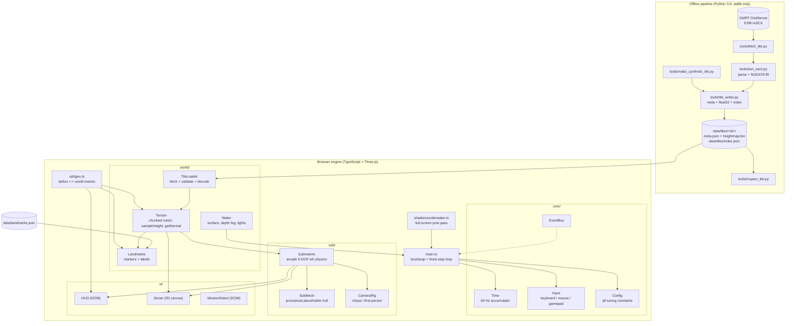

# Architecture

Submarine Explorer renders **real ocean-floor bathymetry** from the GMRT
synthesis as a navigable 3D world. There are two halves that meet at one
documented interface:

1. an **offline Python pipeline** (`tools/`) that downloads bathymetry and
   writes tiles, and
2. a **browser engine** (`src/`) that loads tiles and simulates a submarine.

The interface between them is the tile format — see
[`docs/tile-format.md`](./tile-format.md). Neither half knows anything else
about the other.

## Module diagram



## Data flow

**Build a tile (offline, once per dive site).**
`fetch_tile.py` probes the GMRT metadata endpoint for the grid size, applies the
4M-cell guard, downloads ESRI ASCII, parses it, fills NODATA, and writes
`heightmap.bin` + `meta.json` + a refreshed `index.json`.

**Boot (per page load).**
`main.ts` reads `?tile=<id>` (falling back to the first entry of `index.json`),
`TileLoader` fetches and validates the pair, `Terrain` meshes it, `Water`
installs fog and lights, `Landmarks` overlays any markers inside the bbox, and
the submarine spawns 90 m above the seabed at the tile centre.

**Per frame.**

```
requestAnimationFrame
  └─ Input.sample()                      normalise keyboard/mouse/gamepad
  └─ Time.tick(now) -> N                 how many 60 Hz steps are owed
  └─ N x Submarine.step(input, 1/60)     deterministic physics
  └─ Submarine.getState()                snapshot for the UI
  └─ SubMesh / CameraRig / Water.update  presentation, using the REAL frame delta
  └─ HUD.update / Sonar.update           DOM + 2D canvas
  └─ render scene -> WebGLRenderTarget
  └─ UnderwaterPass -> screen
  └─ Input.endFrame()                    clear edge-triggered state
```

Physics is fixed-step so behaviour does not change with frame rate; everything
visual uses the variable frame delta, and camera smoothing is expressed as a
half-life so it feels identical at 30 and 144 fps.

## Coordinate conventions

```
+X = EAST   metres
+Z = SOUTH  metres      (NOT north)
+Y = UP     metres      sea level = 0, seabed is negative
origin      the tile centre (meta.center)
yaw  = 0    faces NORTH (-Z);  yaw = +90 degrees faces EAST (+X)
```

Rationale for `+Z = south`: looking straight down the -Y axis then produces a
conventional north-up map with +Z running down the screen, and the heightmap's
row order (row 0 = north edge) maps directly onto increasing Z with no flip
anywhere in the engine. Every module depends on this; `src/util/geo.ts` is the
single place the conversion lives, and `tests/unit/geo.test.ts` pins it down.

Depths are always **negative metres**. The HUD shows `Math.abs(depth)` because
crews say "three thousand metres", not "minus three thousand".

## Performance budget

Target: **60 fps at 1080p on integrated graphics**, for tiles up to **4M cells**
(the pipeline's hard guard).

| Cost             | Approach                                                                                                                    | Budget                                      |
| ---------------- | --------------------------------------------------------------------------------------------------------------------------- | ------------------------------------------- |
| Terrain vertices | one `BufferGeometry` per 128x128-cell chunk; adjacent chunks share their boundary row/column so seams stay watertight       | <= 4M vertices, ~16 k per chunk             |
| Draw calls       | one per chunk, all sharing a single `MeshStandardMaterial`; `frustumCulled` is on, so only the chunks in view are submitted | ~250 chunks worst case, typically <30 drawn |
| Mesh build       | once at load, on the main thread; ~500x500 cells takes a few tens of ms                                                     | < 400 ms for 4M cells                       |
| Physics          | fixed 60 Hz, at most 8 steps per frame, pure scalar maths, zero allocation in `step()`                                      | < 0.1 ms/frame                              |
| HUD              | DOM writes guarded by a value cache, so an unchanged field costs nothing                                                    | < 0.1 ms/frame                              |
| Sonar            | bathymetry rasterised **once** into an offscreen canvas; per frame it is one `drawImage` plus a few paths                   | < 0.3 ms/frame                              |
| Post-process     | single full-screen pass into one `WebGLRenderTarget`                                                                        | 1 extra full-screen fill                    |

The two current tiles (548x546 and 820x638) are around 0.3–0.5M cells and draw
in 25 and 42 chunks respectively.

**Future LOD plan** (not implemented). The chunk grid exists precisely to make
this cheap to add later:

1. Build 2–3 decimated index buffers per chunk (stride 1, 2, 4) sharing the one
   vertex buffer, and pick by camera distance. Stitch seams with skirts rather
   than by matching edge resolution.
2. Move the mesh build into a Web Worker and stream chunks in by distance, so a
   4M-cell tile has no load-time hitch.
3. Replace the per-vertex colour with a depth-ramp lookup in a fragment shader,
   which removes the colour attribute (a third of the vertex bandwidth) and lets
   the ramp be changed at runtime.

## Extension points

| I want to...                          | Do this                                                                                                                                                                                                         |
| ------------------------------------- | --------------------------------------------------------------------------------------------------------------------------------------------------------------------------------------------------------------- |
| Add a dive site                       | run `tools/fetch_tile.py`; `index.json` and the mission list pick it up automatically                                                                                                                           |
| Add a landmark                        | add it to `data/landmarks.json`; `Landmarks` places anything with a `lat`/`lon` inside the tile bbox                                                                                                            |
| Retune handling, fog, colours, camera | `src/core/Config.ts` — every constant in the game lives there                                                                                                                                                   |
| Swap the placeholder hull for a model | replace the `SubMesh` construction in `main.ts` with a `GLTFLoader` result; the rig only needs an `Object3D` facing -Z                                                                                          |
| React to game events                  | `EventBus`: add your event to the `GameEvents` interface and `bus.on(...)`. Already emitted: `tile:loaded`, `tile:error`, `terrain:built`, `landmarks:loaded`, `sub:collided`, `sub:crushWarning`, `game:ready` |
| Add a control scheme                  | extend `Input.sample()`; consumers only read the normalised axes, so touch or a new pad needs no changes elsewhere                                                                                              |
| Add a visual effect                   | `shaders/underwater.ts` is already a render-target + full-screen-quad pass; add uniforms, or chain a second pass                                                                                                |
| Add a new data source                 | write a `tools/fetch_*.py` that ends in `tile_writer.write_tile()`; the engine only knows the tile format                                                                                                       |
| Query the terrain from new code       | `Terrain.sampleHeight(x, z)` (bilinear, metres) and `Terrain.getNormal(x, z)`; both clamp outside the tile                                                                                                      |
| Debug in the browser                  | `window.__game` exposes `{ scene, renderer, terrain, sub, rig, water, bus, config, meta }`                                                                                                                      |
