# Architecture

Bathyline (repository/package: `submarine-explorer`) renders **real ocean-floor bathymetry** from the GMRT
synthesis as a navigable 3D world, with scan-and-discover missions on top.
There are three parts that meet at documented interfaces:

1. an **offline Python pipeline** (`tools/`) that downloads bathymetry and
   writes tiles,
2. **content packs** (`data/landmarks.json`, `data/landmarks/<id>/`): JSON that
   places POIs, props, field-guide text and missions on a tile, and
3. a **browser engine** (`src/`) that loads both and simulates a submarine.

The pipeline/engine interface is the tile format —
[`docs/tile-format.md`](./tile-format.md). The content schemas are in
[`plan/PHASE-B-CONTRACTS.md`](../plan/PHASE-B-CONTRACTS.md) §2. Neither the
pipeline nor the content knows anything else about the engine.

## Module diagram

Phase C integration (2026-09-22): `ui/Globe.ts` and `GlobeModel.ts` provide
the globe picker (opened from the home/pause menu or `?globe=1`; the standalone
`N` key was retired in D-SHELL) and the field guide has an OBIS species tab
through `game/Species.ts`. `world/presets/Presets.ts` now selects and
enters an environment after props/POIs load. Its per-frame update follows
`Atmosphere.update`, before fog, headlights, snow and post-processing consume
the sample. Current coupling receives zero simulated time while the briefing
or globe freezes the game. `window.__game.presets` exposes selection, entry
state, current and debug statistics. `world/Currents.ts` loads the offline
HYCOM grid for each tile; `window.__game.currents` exposes its load status.
The gameplay current setting scales or disables both that field and preset
force. See [presets.md](./presets.md) and [currents.md](./currents.md).

Public data and asset defaults resolve through `util/publicUrl.ts` using
Vite's deployment base. Explicit loader roots retain their caller-provided
meaning. See [deploy.md](./deploy.md) for the project-base browser check.
C5 is now wired end to end: `core/Save.ts` persists settings (graphics tier,
post-fx, terrain detail, default sim speed, reduce-motion, captions, sonar
palette), `ui/Settings.ts` is the settings screen (opened from the home or
pause menu, not a dedicated key) that reads and writes it, and
`ui/Captions.ts` renders the on-screen caption line from `AudioSystem`'s
`CaptionBus` (sonar ping/echo, scan chimes). See [settings.md](./settings.md)
and [audio.md](./audio.md).

**Phase D — playability (2026-09-24).** The app shell gained explicit
`'home' | 'dive' | 'pause'` states (`GameEvents['app:state']`), driven by two
new full-screen overlays: `ui/Home.ts` (Bathyline title screen: Continue/Dive
sites/Free dive/Daily dive/mode/Journal/Settings/Controls/Upgrades) and `ui/PauseMenu.ts` (`Esc`:
Resume/Objectives/Mission select/Journal/Settings/Controls/Quit to home).
Both retire the old `O` (settings) and `N` (globe) hotkeys — `Input`'s
`defaultActions()` no longer binds `toggleSettings` or `toggleGlobe` at all;
those screens open only from a menu button now. `Save`'s settings record is
versioned `v2` and gained a `gameplay` block (`Config.settings.gameplayPresets`
'arcade' | 'realistic', plus 'custom') covering speed/descent profile, lights,
sensors, visual waypoints, sonar markers, start position, battery/oxygen and currents —
`src/core/Config.ts` `speedProfiles` / `descentProfiles` / `lightPresets` /
`sensorPresets` hold the numeric presets. `Input`'s bindings are versioned
`v3` (migrating v2), with defaults R/F pitch, Space rise, Ctrl-or-C sink,
Shift boost, G scan, Q camera, X reset camera and no `ping` action. `ui/Journal.ts` (`game/JournalData.ts`)
replaces the field guide as the `J` destination: a Civilopedia-style catalogue
of site/POI/species entries built from existing content files, still reading
`DiscoveryStore`'s unchanged `subexplorer.discoveries.v1` for unlocks, plus a
photo gallery tab (`ui/PhotoGallery.ts`). `ui/Waypoints.ts` draws the D-SCAN
world-space waypoint, off-screen edge arrow and objective hint text when the
`visualHints` gameplay option is on. `sonarMarkers` separately controls
POI/objective/scanned icons on the sonar; seabed relief remains visible. `ui/Sonar.ts` gained POI/objective icons
and zoom levels (`Config.sonarZoom`: 250/500/1000/2000 m or the whole tile,
`M` to expand, buttons or `+`/`-` to change range, and the mouse wheel
anywhere while expanded; the camera does not zoom in that state). `game/Power.ts` is the optional
battery/oxygen system (`docs/power.md`); `world/Currents.ts` loads an offline
per-tile HYCOM current grid from `data/currents/<tile>.json`
(`docs/currents.md`); both are gated by the `gameplay.batteryOxygen` and
`gameplay.currents` settings. `rov/Rov.ts` + `rov/RovVisual.ts` + `ui/RovHUD.ts`
are the tethered ROV (`E` to deploy/retrieve; it flies, scans and returns, with
its own chase camera). `ui/PhotoMode.ts` + `game/PhotoStore.ts` are photo mode
(`P`; `Enter`/`Space` captures): a free-orbit camera around the sub or the
deployed ROV, saving captioned JPEG thumbnails to `subexplorer.photos.v1`,
newest 24 kept. A visible Capture button records photos, and the gallery
downloads individual JPEGs or one ZIP. `MissionState` gained a `primaries-complete` stage between
`diving` and `debrief` (`mission:primaryComplete`, `mission:ended`), so
finishing the primaries no longer force-opens the debrief. The D2 chase camera starts farther behind and higher above the
sub, follows yaw but not pitch, and keeps a world-fixed direction after manual
free look. `X`, the HUD button or a double-click restores the chase view.
Arcade Lost City's composed 38 m opening sets a 50 m reset distance, independent
of wheel zoom (35–180 m). Its original 10° heading offset is preserved; a
local X offset of −20 m in the chase vector moves the hull off Poseidon's axis
before that vector is normalized to the 50 m arm. The spawn pose carries
`chaseOffsetX` alongside `chaseRadius`. `CameraRig.setChaseRadiusDefault(radius?, offsetX?, offsetY?, portraitOffset?)`
sets the current/reset distance and framing; omitting the arguments restores
the configured arm and zero extra lateral offset. The optional `{ x, y, radius? }` portrait
override is carried by `SpawnPose.portraitChaseOffset` and applied only below aspect 1.
Its optional radius sets the portrait arm length at default zoom; wheel zoom and
free look scale that arm relative to the shared desktop reset distance. Endurance
uses a 52 m portrait arm while its desktop camera inherits the global radius.
Challenger and Endurance use a centred, lower portrait chase arm to keep the
level hull, seabed and scan reticle clear; rotating the screen and resetting
the camera retain the dive's framing defaults. Surface,
Daily, missing-content and Realistic/Custom mission starts clear the Lost City
override; other sites retain their existing camera defaults. Briefing mode
changes preview the current saved mode, including when the start choice stays
the same. Chase resets are ignored while photo orbit is active; its 6–220 m
zoom is separate and exiting restores the prior camera mode and chase distance.
Pointer look is started from Settings → Controls and released by menus. The
briefing now previews the chosen start pose before Begin and does not move the
sub after the dive starts. The hull gauge compares depth with the fitted
class’s rated depth; the optional vignette starts beyond that rating, while
the separate crush depth is 10% deeper and triggers an emergency blow. Class C
is rated to 11,000 m for Challenger Deep. Realistic near-site starts deduct a
simulated descent from battery and oxygen, and marine snow follows currents.

```mermaid
flowchart TD
  subgraph pipeline["Offline pipeline (Python 3.9, stdlib only)"]
    GMRT[("GMRT GridServer\nESRI ASCII")]
    ETOPO[("ETOPO 2022 via ERDDAP\nfallback")]
    CACHE[(".cache/gmrt-raw/\n(gitignored)")]
    FA["tools/fetch_all.py\nTier-2 batch: plan, probe, retry"]
    FT["tools/fetch_tile.py"]
    EA["tools/esri_ascii.py\nparse + NODATA fill"]
    TW["tools/tile_writer.py\nmeta + float32 + index"]
    CT["tools/compress_tiles.py\n.gz / .br / heightmap16.bin"]
    MS["tools/make_synthetic_tile.py"]
    IT["tools/inspect_tile.py"]
    VP["tools/validate_props.py"]
    GMRT --> FA
    ETOPO -.-> FA
    FA <--> CACHE
    FA --> FT
    GMRT --> FT --> EA --> TW
    MS --> TW
    TW --> DISK
    DISK --> CT --> DISK
    DISK --> IT
  end

  DISK[("data/tiles/&lt;id&gt;/\nmeta.json, heightmap.bin, heightmap16.bin\ndata/tiles/index.json")]
  LM[("data/landmarks.json")]
  PACK[("data/landmarks/&lt;id&gt;/\nmission, pois, guide, props\ndata/landmarks/index.json")]
  GLB[("public/assets/models/*.glb\npublic/assets/decoders/draco/")]
  PACK --> VP

  subgraph engine["Browser engine (TypeScript + Three.js)"]
    MAIN["main.ts + app/\nboot, ordered systems, frame loop"]

    subgraph core["core/"]
      TIME["Time\n60 Hz accumulator"]
      INPUT["Input\naction map, keyboard / mouse / gamepad"]
      BUS["EventBus\ntyped GameEvents"]
      CFG["Config\nall tuning constants"]
      SAVE["Save (C5)\nsettings persistence, localStorage v1"]
    end

    subgraph world["world/"]
      TL["TileLoader\nfetch + validate + decode"]
      TER["Terrain / TerrainChunk / TerrainNoise / TerrainMaterial\nchunks, detail, LOD, sampleHeight"]
      WAT["Water\nsurface lid"]
      LMK["Landmarks\nmarkers + labels"]
      PROPS["Props + PropLoader\nplacement, LOD/impostor, collide()"]
      PSUB["props/\nProcedural, Collision, Wiring, PlacementDebug"]
      PRE["presets/ (C3)\nPresetSystem + vent/brine/canyon/reef/\ntrench/wreck/seamount/default"]
      CUR["Currents (D-CURRENTS)\noffline per-tile HYCOM grid, data/currents/*"]
    end

    subgraph render["render/"]
      ATM["Atmosphere\ndepth bands, fog, lights, caustics"]
      HL["Headlights"]
      SNOW["MarineSnow"]
    end

    subgraph game["game/"]
      CP["ContentPath"]
      POI["Pois / Guide"]
      SCAN["Scanner"]
      DS["DiscoveryStore\nlocalStorage v1"]
      OBJ["Objectives + SessionStats"]
      DISC["Discovery\nwires scan, guide, debrief"]
      MIS["Mission\nmanifest + state machine"]
      MR["MissionRouter\n?mission=, loadout, nav"]
      SPEC["Species (C4)\nloads species.json for the guide's SPECIES tab"]
      JD["JournalData (D-FLOW)\nsite/POI/species entries from content + DiscoveryStore"]
      PWR["Power (D-POWER)\nbattery/oxygen drain, warnings, emergency ascent"]
      PS["PhotoStore (D-PHOTO)\nlocalStorage v1, newest 24"]
    end

    subgraph sub["sub/"]
      PHY["Submarine\narcade physics, hull stress, crush"]
      SM["SubMesh\nprocedural placeholder hull"]
      CAM["CameraRig\nchase / first-person / orbit / photo"]
    end

    subgraph rov["rov/ (D-ROV)"]
      ROV["Rov\ntethered flight, scan, return"]
      RVIS["RovVisual\nlit chase-view model"]
    end

    subgraph audio["audio/"]
      AUD["AudioSystem\nengine, sonar echo, beds, cues"]
    end

    subgraph ui["ui/ (DOM overlays)"]
      HOME["Home (D-SHELL)\nBathyline title menu + globe after Dive sites/Free dive"]
      PM["PauseMenu (D-SHELL)\nEsc: Resume/Objectives/Mission select/Journal/Settings/Controls/Quit"]
      HUD["HUD"]
      SON["Sonar (2D canvas)\nPOI/objective icons, zoom levels"]
      MSEL["MissionSelect"]
      SO["ScanOverlay"]
      WP["Waypoints (D-SCAN)\nworld marker, edge arrow, objective hint"]
      JRN["Journal (D-FLOW)\nreplaces FieldGuide; site/POI/species + photo gallery tab"]
      PGAL["PhotoGallery (D-PHOTO)"]
      PHM["PhotoMode (D-PHOTO)\nfree-orbit viewfinder"]
      RHUD["RovHUD (D-ROV)"]
      DB["Debrief"]
      BR["Briefing"]
      OP["ObjectivesPanel"]
      GL["Globe + GlobeModel (C1)\ndive-site picker, opened from Home/PauseMenu or ?globe=1"]
      SET["Settings (C5/D-MODES)\nopened from Home/PauseMenu: tier, postFx, captions, bindings, Gameplay mode"]
      CAPT["Captions (C5)\nrenders AudioSystem's CaptionBus"]
    end

    SHD["shaders/underwater.ts\nfull-screen post pass"]
    GEO["util/geo.ts\nlat/lon <-> world metres"]
  end

  DISK --> TL --> TER
  LM --> LMK
  PACK --> CP
  CP --> POI & PROPS & MIS
  GLB --> PROPS
  PROPS --> PSUB
  MAIN --> TIME & INPUT & CFG
  TER --> PHY & SON & LMK & PROPS & CAM & AUD & DISC
  PSUB --> PHY
  PHY --> CAM & HUD & SON & SM
  POI --> DISC
  SCAN & DS & OBJ --> DISC
  DISC --> SO & WP & DB
  MR --> MIS
  MR --> BR & OP & DB
  MR --> DISC
  ATM --> SHD
  GEO --> TER & HUD & LMK & POI & PROPS & MR
  BUS -.-> AUD & DISC & MIS & MR & ATM
  TER & PACK & DISC --> PRE
  PRE --> ATM
  LM --> GL
  CP --> SPEC --> JRN
  DS --> JD --> JRN
  MAIN --> SAVE --> SET
  AUD --> CAPT
  MAIN --> HOME & PM
  GL --> HOME & PM
  SET --> HOME & PM
  CUR --> PHY
  MAIN --> PWR
  PHY --> PWR --> HUD
  MAIN --> ROV --> RVIS & RHUD
  TER --> ROV
  MAIN --> PHM --> PS --> PGAL --> JRN
```



Solid arrows are construction-time dependencies or per-frame data; dashed
arrows are EventBus traffic. `Submarine` depends only on the narrow
`HeightField` interface, and props reach it through `PropContact`
(`world/props/Wiring.ts`), not by import.

## Data flow

**Build a tile (offline, once per dive site).**
`fetch_tile.py` probes the GMRT metadata endpoint for the grid size, applies the
4M-cell guard, downloads ESRI ASCII, parses it, fills NODATA, and writes
`heightmap.bin` + `meta.json` + a refreshed `index.json`. `fetch_all.py` does
this for every Tier-2 landmark: it plans the bbox from `data/landmarks.json`,
picks the finest resolution under 8 MB / 1500 cells a side, caches raw
responses in `.cache/gmrt-raw/`, retries with backoff and falls back to ETOPO.
`compress_tiles.py` then writes `.gz` (and `.br` when the CLI exists) and, with
`--quant16`, `heightmap16.bin` + the `quant_*` meta keys. See
[`docs/tiles-inventory.md`](./tiles-inventory.md).

**Boot (per page load, `app/boot.ts`, then each system's `init` in
`app/systems.ts` order).** The app shell starts in one of three
states — `'home' | 'dive' | 'pause'` (`GameEvents['app:state']`). Plain `/`
boots into `'home'`: `ui/Home.ts` shows the Bathyline menu over a decorative
Monterey Canyon title scene. DOM and Tab order is Continue, Dive sites, Free dive,
Daily dive (when available), mode selector, Journal, Settings, Controls, Upgrades.
First focus is Continue when enabled, otherwise Dive sites. Dive sites and Free
dive replace the menu with the embedded C1 globe and scrolling selector; Back or
Escape closes the globe and restores focus to the originating button. The loaded
gameplay world stays paused (no physics, audio or mission clock) until a site is
chosen. `?mission=`, `?tile=` or `?skipBriefing=1` (and the existing
debug params `?poi=`, `?at=`, `?depth=`, `?debrief=1`, `?globe=1`) bypass home
and boot straight to `'dive'`, as they did before D-SHELL. `Esc` during a dive
enters `'pause'` (`ui/PauseMenu.ts`), which freezes the sim the same way the
briefing, globe and settings dialog already did; `Escape` again, or Resume,
returns to `'dive'`.

1. In parallel: `TileLoader.loadIndex()` and `resolveMissionRoute(params)`
   (fetches `data/landmarks/<id>/mission.json` for `?mission=`).
2. `chooseTileId`: the mission's tile, else `?tile=`, else
   `Config.defaultTileId` (`titanic`) if indexed, else the first indexed tile.
3. `TileLoader.load` → `tile:loaded` (or `tile:error` + a fatal overlay).
4. `Terrain` meshes the tile → `terrain:built`. `Atmosphere`, `Headlights`,
   `MarineSnow`, `Water` install lighting and effects. `Landmarks` loads
   `data/landmarks.json` asynchronously → `landmarks:loaded`.
5. `Submarine` spawns 90 m above the seabed at the tile centre (or at `?depth=`),
   then `applyMissionLoadout` (hull class, sim speed, surface spawn) if a
   mission is routed.
6. `SubMesh`, `CameraRig`, `HUD`, `Sonar`.
7. `Discovery` loads `pois.json` + `guide.json` for the content folder
   (mission landmark, else `?landmark=`, else the tile id); `?poi=` re-spawns the
   sub next to a POI once they load.
8. `Props` loads `props.json` asynchronously → `props:loaded`; `?at=` re-spawns
   the sub; `PropContact` is created; `?debugProps=1` adds `PlacementDebug`.
9. `MissionSelect` lists tiles and (via `loadMissionSummaries`) missions; the
   `Home` and `PauseMenu` overlays share it for their site pickers.
10. `Input`, `Settings` (a dialog opened from Home/PauseMenu, not a key),
    `Power`, `Currents`, `Rov`/`RovVisual`/`RovHUD`, `PhotoMode`/`PhotoStore`,
    then `MissionRouter` (briefing, objectives, completion) if routed. Saved
    tier/detail apply before terrain construction; saved sim speed and the
    saved gameplay mode's speed/descent/light/sensor profile apply after the
    mission loadout.
11. `AudioSystem` (unlocked by the first pointerdown/keydown), captions and
    live settings subscriptions, `UnderwaterPass`.
12. `window.__game` is populated and the first frame is requested.

Every content loader treats a missing or malformed file as "none" and never
throws at boot.

**Per frame (`app/loop.ts`; system hooks run in `FRAME_STAGES` order, see
"Phase F structure" below).**

```
requestAnimationFrame
  └─ Input.sample()                          normalise keyboard/mouse/gamepad
  └─ Time.tick(now) -> N                     60 Hz steps owed (max 8)
  └─ briefing/globe/settings frozen?        N = 0, FROZEN_INPUT
  └─ N x Submarine.step(input, 1/60)         each runs simSpeed (1-3) fixed sub-steps
  └─ PropContact.resolve(sub, dt)            push the hull out of prop colliders
  └─ edge actions                            camera, photo mode, sonar, lights, sim speed
  └─ Submarine.getState()                    snapshot; emits sub:collided, sub:crushWarning,
                                             sub:hullStress, sub:emergencyBlow
  └─ SubMesh / CameraRig                     presentation, using the REAL frame delta
  └─ Atmosphere.update -> PresetSystem ->    depth band, preset modifiers, current
     Headlights /
     MarineSnow / Water.update
  └─ HUD.update / Sonar.update               DOM + 2D canvas
  └─ Discovery.update(N/60, dt, ...)         scan beam, Journal (J), overlays
  └─ MissionRouter.update(clockDt, dt, ...)  objectives panel, nav line, completion
  └─ Props.update(camera)                    per-prop full / impostor / hidden
  └─ AudioSystem.update(frame)               depth low-pass, thruster, beds, ping
  └─ Terrain.update(camera)                  chunk LOD + draw-call accounting
  └─ home menu: title scene -> shared canvas (skip gameplay/post draw)
  └─ otherwise: scene -> WebGLRenderTarget   (low tier: straight to screen)
  └─ UnderwaterPass -> screen                band grade tint + vignette
  └─ Input.endFrame()                        clear edge-triggered state
  └─ first frame only: window.__gameReady = true, game:ready
```

Physics is fixed-step so behaviour does not change with frame rate; sim speed
runs more whole sub-steps inside `Submarine.step` rather than a larger `dt`.
Scan progress takes `N/60` seconds. The mission clock uses the unfrozen frame
delta so fixed-step backlog limits do not slow the displayed dive time.
Both stop during briefing/globe/settings pauses and are not multiplied by sim
speed. Everything visual uses the variable frame delta, and camera smoothing is expressed as a
half-life so it feels identical at 30 and 144 fps.

## Phase F structure

F0-CORE split the old merge hotspots so that parallel packages each edit their
own files.

- **App systems (`src/app/`).** `main.ts` only boots, initialises the systems
  and starts the loop. `boot.ts` builds the `BootContext`: params, config, bus,
  save, quality tier, tile, renderer and scene. Each file in `app/systems/`
  exports a `GameSystem` with the following parts:
  - `init(ctx)` builds its objects and publishes them on the shared
    `GameContext`.
  - Optional `start(ctx)` runs after every system's init.
  - `frame` holds per-stage hooks.
  - Optional `dispose()` tears the system down.

  `app/systems.ts` is the ordered list. Init order equals the pre-F0 build
  order, which DOM, key-listener and `app:state` listener order depend on (the
  list is annotated, and `tests/unit/appSystems.test.ts` pins the
  constraints). `FRAME_STAGES` in `app/System.ts` is the frame, in order.
  Systems sharing a stage run in list order. A system adds debug handles with
  `ctx.expose({...})`, and they end up on `window.__game`.

- **Config (`src/core/config/`).** There is one file per domain (types and
  defaults), and `types.ts` holds the `GameConfig` contract.
  `src/core/Config.ts` assembles `DEFAULT_CONFIG`, owns `makeConfig` and
  re-exports everything, so imports are unchanged.
- **Styles (`src/styles/`).** There is one file per module. `src/styles.css`
  `@import`s them in cascade order, so append new files at the end.
- **Procedural props (`src/world/props/builders/`).** There is one file per
  family: `wrecks`, `debris`, `vents`, `reefs`, `geology`, `generic`, and
  `shared` for helpers and types. `PROCEDURAL_BUILDERS` maps each kind to its
  builder. `props/Procedural.ts` is a compatibility barrel.
- **Quality tiers v2 (`src/core/Quality.ts`).** There are four tiers, `low`,
  `medium`, `high` and `ultra`, plus the `auto` setting. `detectTier()` is a
  pure heuristic over a `DeviceCaps` snapshot and checks, in order:
  1. A software renderer gives `low`.
  2. Tiny GPU limits, or 2 cores or 2 GB or less, give `low`.
  3. A phone gives `low`, or `medium` with a flagship GPU.
  4. A tablet gives `medium`, or `low` when small.
  5. A discrete GPU gives `high`.
  6. Old Intel gives `low`.
  7. Anything else gives `medium`.

  `ultra` is never automatic. Precedence is `?tier=` (including `?tier=auto`),
  then the saved setting, then detection. The default setting is `medium`.
  Dynamic resolution (`DynamicResolution`, run by `app/systems/quality.ts`)
  runs only for auto-detected tiers or with `?dynres=1`. `window.__game.perf`
  exposes `drawCalls`, `triangles`, `frameMs`, `tier`, `tierSource`,
  `pixelRatio`, `maxPixelRatio`, `resolutionScale` and `dynamicResolution`.

- **Assets (`src/core/assets/`).** `assets.loadGLTF(url)` handles Draco,
  Meshopt and KTX2. `assets.loadTexture(url, { srgb, repeat })` loads PNG, JPEG,
  WebP or KTX2. `assets.preload(manifest.assets)` never rejects. KTX2 needs
  `assets.setRenderer(renderer)` first. The decoders live in
  `public/assets/decoders/{draco,basis}/`, and the Vite config stops three
  from emitting its own copies.

## Coordinate conventions

```
+X = EAST   metres
+Z = SOUTH  metres      (NOT north)
+Y = UP     metres      sea level = 0, seabed is negative
origin      the tile centre (meta.center)
yaw  = 0    faces NORTH (-Z);  yaw = +90 degrees faces EAST (+X)
```

Rationale for `+Z = south`: looking straight down the -Y axis then produces a
conventional north-up map with +Z running down the screen, and the heightmap's
row order (row 0 = north edge) maps directly onto increasing Z with no flip
anywhere in the engine. Every module depends on this; `src/util/geo.ts` is the
single place the conversion lives, and `tests/unit/geo.test.ts` pins it down.

Depths in the engine are always **negative metres**. Depths in content files
(`depth_m` in `data/landmarks.json` and `data/landmarks/<id>/*.json`) are
**positive magnitudes**; loaders convert with `y = -depth_m`. The HUD shows
`Math.abs(depth)` because crews say "three thousand metres", not "minus three
thousand". Content `heading_deg` is a compass heading (0 = north, 90 = east),
the same as the sub's yaw.

## EventBus

`GameEvents` in `src/core/EventBus.ts` is the complete list. Add events there;
never repurpose one.

| Event                     | Payload                                                | Emitted by                                                 |
| ------------------------- | ------------------------------------------------------ | ---------------------------------------------------------- |
| `app:state`               | `{ state: 'home' \| 'dive' \| 'pause' }`               | `main.ts` on every shell-state transition (D-SHELL)        |
| `app:siteSelected`        | `{ missionId: string \| null, tileId: string }`        | `main.ts` from Home/PauseMenu/Globe site pickers (D-SHELL) |
| `tile:loaded`             | `{ meta: TileMeta }`                                   | `main.ts` after `TileLoader.load`                          |
| `tile:error`              | `{ id, error }`                                        | `main.ts` on a failed load                                 |
| `terrain:built`           | `{ chunks, vertices }`                                 | `main.ts` after `Terrain` construction                     |
| `landmarks:loaded`        | `{ landmarks: Landmark[] }`                            | `main.ts` when any landmark is placed                      |
| `sub:collided`            | `{ depth, speed }`                                     | `main.ts` (seabed); `PropContact` (props)                  |
| `sub:crushWarning`        | `{ depth, ratio }` (ratio is depth / crush depth)      | `main.ts`, every frame beyond the rated depth              |
| `sub:hullStress`          | `{ stress, cause: 'impact' \| 'pressure', depth }`     | `main.ts`, on a change above threshold                     |
| `sub:emergencyBlow`       | `{ depth, lockSeconds, cause?: 'crush' \| 'power' }`   | `main.ts`, once per blow                                   |
| `sub:simSpeed`            | `{ multiplier }`                                       | `main.ts` on `T`                                           |
| `env:depthBand`           | `{ band, previous, depth }`                            | `Atmosphere.update` on a band change                       |
| `env:preset`              | `{ preset, landmarkId }`                               | `PresetSystem` after selection                             |
| `env:current`             | `{ dirDeg, speedMps }`                                 | `PresetSystem` on a significant current change             |
| `env:trench`              | `{ depth }` (negative engine metres)                   | `TrenchPreset`; audio plays a pressure creak               |
| `globe:opened`            | `{ source }`                                           | `Globe` on opening                                         |
| `globe:pinSelected`       | `{ landmarkId }`                                       | `Globe` on selection                                       |
| `scan:started`            | `{ poiId }`                                            | `Scanner`                                                  |
| `scan:progress`           | `{ poiId, progress }` (0..1, ≤ 10 Hz)                  | `Scanner`                                                  |
| `scan:aborted`            | `{ poiId, reason: 'range' \| 'facing' \| 'released' }` | `Scanner`                                                  |
| `scan:complete`           | `{ poiId, landmarkId, firstTime }`                     | `Scanner`                                                  |
| `discovery:secret`        | `{ landmarkId, secretId, name, firstTime }`            | `explore` after a hidden discovery scan                    |
| `discovery:sample`        | `{ landmarkId, sampleId, name }`                       | `explore` after collection (once per dive)                 |
| `event:witnessed`         | `{ landmarkId, eventId, kind }`                        | `explore` when a nearby event enters the camera view       |
| `guide:opened`            | `{ entryId }`                                          | `Journal` when an unlocked entry is shown                  |
| `mission:started`         | `{ missionId, tileId }`                                | `Mission` on Begin dive                                    |
| `mission:objective`       | `{ missionId, objectiveId, complete }`                 | `Mission`                                                  |
| `mission:primaryComplete` | `{ missionId, completed, total }`                      | `Mission` on the last primary scan                         |
| `mission:complete`        | `{ missionId, durationS }`                             | `Mission.end()`, once, after the primaries                 |
| `mission:ended`           | `{ missionId, reason, completed, total, durationS }`   | `Mission.end()`, every debrief                             |
| `mission:restart`         | `{ missionId }`                                        | `Mission.restart()` (debrief Dive again)                   |
| `mission:aborted`         | `{ missionId, reason: 'crush' \| 'power' }`            | `MissionRouter` when an emergency blow ends                |
| `props:loaded`            | `{ landmarkId, count, models, procedural }`            | `main.ts` when `Props.load` resolves                       |
| `game:ready`              | `{ tileId }`                                           | `main.ts`, first presented frame                           |
| `ui:selectTile`           | `{ id }`                                               | declared, not emitted or handled yet                       |
| `settings:changed`        | `{ key, value }`                                       | declared (C5), not emitted or handled yet                  |

Current subscribers: `AudioSystem` (`sub:collided`, `sub:hullStress`,
`sub:emergencyBlow`), `Discovery` (`scan:complete`, `landmarks:loaded`),
`Mission` (`scan:complete`), `MissionRouter` (`sub:simSpeed`). Nothing
subscribes to `env:depthBand` yet (the audio beds compute their own band
weights from depth). `AudioSystem` also handles `scan:complete` (chime/tick)
and `env:trench` (pressure creak, sharing the hull-stress cooldown).
`ui/Settings.ts` writes through `core/Save.ts` (`save.save()`); `main.ts`
subscribes to `save.onChange()` directly for live changes (captions,
reduce-motion, palette, post-FX and the live gameplay profile). Tier/detail/
default-speed apply on reload. `main.ts` also subscribes to `app:state`
itself (D-SHELL) to pause/resume audio, close photo mode and abort a deployed
ROV outside the `'dive'` state, and `journal.setHomeMode` toggles the
Journal's home-mode framing. `settings:changed` **is** emitted now (`Save.commit`,
once per changed key), but still has no subscriber — `main.ts` keeps using
`save.onChange()` directly. `ui:selectTile` remains declared only, with
nothing emitting or handling it.

Audio captions use a separate `CaptionBus` (`AudioSystem.captions`), not the
EventBus; see [`docs/audio.md`](./audio.md).

## Persistence

| localStorage key             | Owner                    | Shape                                                                                                                                                                                                                                     |
| ---------------------------- | ------------------------ | ----------------------------------------------------------------------------------------------------------------------------------------------------------------------------------------------------------------------------------------- |
| `subexplorer.bindings.v3`    | `core/Input.ts`          | `{ version: 3, keys: Record<ActionId, string[]> }`; migrates saved v2 and v1 bindings, preserving custom keys                                                                                                                             |
| `subexplorer.discoveries.v1` | `game/DiscoveryStore.ts` | `{ version: 1, discovered: { "<landmark>/<poi>": {...} }, stats }` — unchanged since Phase B, now also read by the Journal                                                                                                                |
| `subexplorer.settings.v2`    | `core/Save.ts`           | `{ version: 2, graphicsTier, postFx, detailStrength, simSpeedDefault, reduceMotion, captions, sonarPalette, uiScale, controlTips, hullWarningStyle, gameplayMode, gameplay, bindings? }`; migrates a saved `subexplorer.settings.v1` once |
| `subexplorer.photos.v1`      | `game/PhotoStore.ts`     | `{ version: 1, photos: [{ id, image (JPEG data URL, ≤640 px), siteId, siteName, poiId, poiName, at, depthM }] }`, newest 24 (D-PHOTO)                                                                                                     |
| `subexplorer.lastSite.v1`    | `main.ts`                | `{ missionId: string }`, written when a mission starts; enables the home screen's Continue button (D-SHELL)                                                                                                                               |
| `subexplorer.tips.v1`        | `main.ts`                | `{ ctrlW: true }` once the one-time "Ctrl+W may close this tab" tip has been dismissed (D-INPUT+HUD)                                                                                                                                      |

All are versioned, guarded (no storage → in-memory), and never throw. The
legacy `subexplorer.bindings.v1` / `.v2` and `subexplorer.settings.v1` keys
are read for migration and then left alone, never deleted. `Save` also points at
the bindings and discoveries keys by name (`SAVE_KEYS`) so a future "reset
everything" screen can find them without importing `Input` or `DiscoveryStore`;
`subexplorer.photos.v1`, `subexplorer.lastSite.v1` and `subexplorer.tips.v1`
are not in `SAVE_KEYS`.

## Performance budget

Target (`plan/DECISIONS.md`): **60 fps at 1080p** on the medium tier (the
owner's Mac) and a "high" tier for a discrete-GPU Linux desktop, selected with
`?tier=low|medium|high`.

| Cost             | Approach                                                                                                                                                                                                             | Notes                                                                                               |
| ---------------- | -------------------------------------------------------------------------------------------------------------------------------------------------------------------------------------------------------------------- | --------------------------------------------------------------------------------------------------- |
| Terrain vertices | one `BufferGeometry` per 64×64-source-cell chunk, sampled at the tier's `detailSubdiv` (1/2/3) vertices per cell, plus a perimeter skirt                                                                             | 129×129 vertices per chunk at medium, 193×193 at high                                               |
| Terrain LOD      | three index buffers per chunk (stride 1/2/4) over the one vertex buffer, picked by camera distance (`lodDistancesM` 1400/4200 m × tier `lodDistanceScale`); skirts hide LOD cracks                                   | see [`docs/terrain.md`](./terrain.md)                                                               |
| Draw calls       | one per visible chunk, all sharing one patched `MeshStandardMaterial`; Three frustum-culls per chunk                                                                                                                 | 81 chunks on `titanic`, 130 on `monterey-canyon`, 361 on `blake-plateau-corals`                     |
| Props            | full mesh inside `lod_distance_m` (default 900 m); impostor (box silhouette / 8-piece debris / cone) out to `max(cullDistanceM 2500, lod × 1.5)`; hidden beyond or outside the frustum                               | hull blocks merge to one draw call; debris is two `InstancedMesh`es ([`docs/props.md`](./props.md)) |
| Mesh build       | once at load, on the main thread                                                                                                                                                                                     | no worker yet                                                                                       |
| Tile download    | loader reads float32 `heightmap.bin`; `heightmap16.bin` (half size) only with `new TileLoader(root, fetch, { prefer16: true })`, which `main.ts` does not use; `.gz`/`.br` for hosts that serve pre-compressed files | 1.2 MB (`titanic`) to 5.8 MB (`blake-plateau-corals`) float32                                       |
| Physics          | fixed 60 Hz, at most 8 steps per frame, pure scalar maths, zero allocation in `step()`                                                                                                                               | < 0.1 ms/frame                                                                                      |
| HUD / overlays   | DOM writes guarded by a value cache, so an unchanged field costs nothing                                                                                                                                             | < 0.1 ms/frame                                                                                      |
| Sonar            | bathymetry rasterised **once** into an offscreen canvas at the tile's aspect; per frame it is one `drawImage` plus a few paths                                                                                       | < 0.3 ms/frame                                                                                      |
| Post-process     | single full-screen pass into one `WebGLRenderTarget`; skipped on the low tier                                                                                                                                        | 1 extra full-screen fill                                                                            |

Chunk counts follow from `ceil((cols-1)/64) × ceil((rows-1)/64)` and do not
depend on the tier. `fitSubdivToBudget` lowers requested terrain subdivision
to fit the `Config.terrain.maxVertices` surface-vertex estimate, with a minimum
subdivision of one. Blake Plateau (1202×1201) therefore uses subdivision one
instead of the roughly 6M/13M vertices requested by medium/high. Chunk borders
and skirts add overhead, so this is not an exact resident-vertex ceiling.
The owner's medium-tier 1080p/60 fps target remains unmeasured.

Not implemented: streaming chunks from a Web Worker, neighbouring-tile
streaming (Tier 4), and a hard draw-call cap.

## Extension points

| I want to...                          | Do this                                                                                                                                                                                |
| ------------------------------------- | -------------------------------------------------------------------------------------------------------------------------------------------------------------------------------------- |
| Add a dive site                       | `tools/fetch_tile.py` (one bbox) or add the id to `TIER2` and run `tools/fetch_all.py --only <id>`; `index.json` and the DIVE SITES list pick it up                                    |
| Add a tile variant                    | `tools/compress_tiles.py --quant16` writes `heightmap16.bin` + `quant_*` meta keys; opt in with `TileLoader`'s `{ prefer16: true }`. Any new variant must update `docs/tile-format.md` |
| Add a landmark marker                 | add it to `data/landmarks.json`; `Landmarks` places anything with a `lat`/`lon` inside the tile bbox                                                                                   |
| Add a mission                         | create `data/landmarks/<id>/mission.json` (contracts §2.4, [`docs/missions.md`](./missions.md)) and append `<id>` to `data/landmarks/index.json`; open with `?mission=<id>`            |
| Add a POI / field-guide entry         | add to `data/landmarks/<id>/pois.json` and `guide.json` (contracts §2.1–2.2, [`docs/discovery.md`](./discovery.md)); test with `?poi=<poiId>`                                          |
| Add a prop                            | add an entry to `data/landmarks/<id>/props.json` (contracts §2.3); run `tools/validate_props.py`; place it live with `?debugProps=1` ([`docs/props.md`](./props.md))                   |
| Add a prop model                      | CC0/CC-BY `.glb` ≤ 2 MB in `public/assets/models/`, 1 unit = 1 m, front −Z, plus an `ATTRIBUTION.md` row; or a new `procedural:<kind>` in `world/props/Procedural.ts` + `PropLoader`   |
| Add an objective type                 | extend `Mission.ts` (only `scan` and `all_primary` exist) and the contracts file                                                                                                       |
| Retune handling, fog, colours, camera | `src/core/Config.ts` — sections `submarine`, `terrain`, `water`, `camera`, `audio`, `scan`, `props`, `mission`                                                                         |
| Swap the placeholder hull for a model | replace the `SubMesh` construction in `main.ts` with a `GLTFLoader` result; the rig only needs an `Object3D` facing -Z                                                                 |
| React to game events                  | `bus.on(...)` any event in the table above; add new ones to `GameEvents`                                                                                                               |
| Add a control                         | add an `ActionId` + entry to `defaultActions()` in `Input.ts`; consumers read `InputState`, so touch or a new pad needs no changes elsewhere                                           |
| Add a visual effect                   | `shaders/underwater.ts` is a render-target + full-screen-quad pass; add uniforms, or chain a second pass. Per-band values come from `Atmosphere.update()`                              |
| Add a new data source                 | write a `tools/fetch_*.py` that ends in `tile_writer.write_tile()`; the engine only knows the tile format                                                                              |
| Query the terrain from new code       | `Terrain.sampleHeight(x, z)` (data + detail, metres) and `Terrain.getNormal(x, z)`; `sampleDataHeight` for survey-only; all clamp outside the tile                                     |
| Debug in the browser                  | `window.__game` (see below), `?debugTerrain=1`, `?debugProps=1`                                                                                                                        |

`window.__game` keys (`main.ts`): `scene`, `renderer`, `terrain`, `sub`, `rig`,
`water`, `atmosphere`, `headlights`, `audio`, `bus`, `config`, `power` (see
[`power.md`](./power.md)), `currents` (see [`currents.md`](./currents.md)),
`rov`, `rovHud`, `rovVisual`, `photos`, `photoMode`, `meta`, `scanner`,
`discoveries`, `discovery`, `debrief`, `fieldGuide` (the `Guide` instance
`discovery.guide` wraps; `Journal` is the separate `journal` key below),
`props`, `propsDebug`, `presets`, `mission`, `missionRouter`, `missionSelect`,
`sonar`, `waypoints`, `journal`, `globe`, `home`, `homeGlobe`, `pause`,
`titleScene` (read-only title diagnostics, described below),
`appState` (a live getter for `'home' | 'dive' | 'pause'`), `save`,
`settings`, `captions`, `input`, `cameraTips` (the live `{ until, moved }` opening
guidance state: `until` is a deadline in `performance.now()` milliseconds, zero
means dismissed, and `moved` records the first commanded move or turn). The strip
fades after that move or 12 seconds; completing all three steering controls still
records learning independently. Layout fixtures can
hold this deadline at Infinity without changing the clock, visibility rules,
learning, bindings, or saved Control tips preference.
`window.__gameReady` flips to `true` after the first presented frame;
`window.__gameError` holds a fatal startup message.

### Bathyline title scene integration

`app/systems/title.ts` registers before `renderSystem` and lazily constructs one
`render/title/TitleScene.ts` scene/camera on first home entry, including quit from
a direct dive URL. It shares the gameplay renderer and `#viewport`; it never moves
the gameplay sub or camera. `TitleTerrain.ts` crops a 2,400 m square of real GMRT
Monterey bathymetry around the checked-in upper-channel POI. Optional terrain loads
after scene creation without blocking `__gameReady`, reusing the boot tile when it
is Monterey. Failure retains the usable vehicle/fog fallback and **Expedition
preview** caption; success labels the crop **Monterey Canyon · Real GMRT bathymetry**.
Vehicle and lighting are illustrative. See [title-scene.md](./title-scene.md).

The bridge reconciles visibility/layout, quality and motion at `render.prepare`.
At `render.draw`, home owns the shared canvas: it presents the title or clears once
to navy in the sites subview, skipping the gameplay/post path. Title draws stop in
sites, dive/pause, hidden documents and covering Settings/Journal/Controls/Upgrades
or overlay globe. Return invalidates a fresh frame; scene objects persist across
home entries and owned resources/listeners are disposed at teardown. The embedded
globe opens only while home and its sites subview are open, the document is visible,
no modal covers it and its layout slot has client rects; exceptionally short layouts
hide that slot and stop the globe renderer too. Title presentation uses the boot
exposure and the canvas render target, restoring the shared renderer's target,
exposure, clear colour/alpha, viewport and scissor state afterwards.

OS or saved reduced motion makes the title static; it redraws on dirty events
such as resize, pixel-ratio or quality changes, terrain readiness and re-entry
(including tab restore and modal close). Between those events static home skips
renderer state calls as well as draws. Animated drawing is capped at
30 fps. Title budgets are 35 calls/100k triangles on Low and 60 calls/200k triangles
on Medium and above. `window.__game.titleScene` exposes snapshots of `active`,
`terrainReady`, `animated`, `drawCount`, `calls` and `triangles`; the counters let
integration tests distinguish a visible canvas from a scene that actually drew.
Home typography is self-hosted DM Sans and Source Serif 4, with system/Georgia
fallbacks. Bathyline metadata keeps the existing save keys, manifest identity,
service worker, package and deployment paths.

### Phase F research integration

`app/boot.ts` waits for `loadSavedProgress()` alongside the tile index and mission
route. Old discovery/photo records are credited before hull checks, without changing
those records. `app/systems/progress.ts` runs first to apply saved upgrades before
vehicles, lights, sensors and power read their config. Its workshop mounts in `start()`
and freezes the simulation at `gate.photo`. Tuning lives in `core/config/progress.ts`.

The new `subexplorer.progress.v1` save contains `version`, spendable `points`,
`lifetime` earnings, a `legacyCredited` migration marker, reward-token `awarded` keys, upgrade levels and best site
`ratings`. `Save.ts` sanitizes older/malformed records and protects future versions.
Discovery saves keep the existing `subexplorer.discoveries.v1` schema and key.
Rating keys accept the same letters, digits, underscores and hyphens as content
folder IDs, including names that match object properties. Valid rating reward
tokens recover lost best-star summaries without generating another RP payout.

`ctx.progress` and `window.__game.progress` expose `award(kind, id): number`.
Kinds are `poi`, `objective`, `species`, `photo`, `primary`, and `rating`. Use stable
subject IDs; POIs/photos use `site/subject`, objectives use `mission/objective`,
and species can use a global species ID. Repeated IDs earn zero. A species scan or
subject photo also satisfies the current dive's bonus goal on repeat visits.
F2-LIFE can call `progress.award('species', speciesId)` on a completed animal scan
and `progress.award('photo', subjectId)` on a successfully captured animal photo.
Migration uses `credit()` so old subjects do not count as new dive activity, and runs
once so later discoveries across separate dives cannot generate retroactive ratings.
Legacy completed surveys use a subject photo or animal scan at that site for the
three-star bonus; another site's animal scan does not supply the bonus.

`MissionSelect.setProgress()` adds hull requirements, free-dive ratings and best
stars. `Globe.setMissionAccess()` keeps locked pins focusable to read their requirement
and prevents a mission launch. The normal e2e feature specs use
`tests/e2e/helpers/unlocked.ts` for an experienced pilot; `f2-progress.spec.ts` uses a
fresh pilot and writes workshop, mission-select and debrief screenshots.

### Phase F curiosity integration

`app/systems/explore.ts` owns the local curiosities and the event scheduler. It
registers after discovery, Journal, audio and ROV; its `world.life` hook runs
before the scanner. `core/config/explore.ts` holds local range, timing and visual
budgets. `window.__game.explore` exposes `ready`, `secrets`, `sampleTargets`,
`faintContacts`, `samples`, `scheduler`, `summary()` and `previewEvent(kind)`.
The preview hook bypasses quiet time for screenshots, without overlapping an event.
Normal scheduling advances only during active dive time, uses the site's habitat,
and waits 70–160 seconds initially, then a 100-second cooldown plus another wait.
`kind` is `plume`, `turbidity`, `snow` or `whale`; an event lasts nine seconds.

Optional `data/secrets/<site>.json` has `version: 1`, `secrets` and `samples`.
Secret rows have `id`, `name`, `kind`, `lat`, `lon`, and Journal `text`; samples
have `id`, `name`, `lat`, and `lon`. Secret kinds are `frame`, `alcove`, `seep`,
`bone`, `wood`, `chain`, and `rock`. `survey_depth_m` and `placement_note` are
content audit notes. The loader ignores invalid rows and treats missing files as
empty. Runtime props follow `Terrain.sampleHeight` across their footprint.
The data is based on the plausible additions in `docs/research/sites.md`.

The scanner's new supplemental pool keeps these targets separate from both POIs
and live wildlife. Secrets emit anonymous sonar blips only within 110 m in 3D,
and scan hints only within 45 m. Samples use the same held scan action within
22 m for 2.5 seconds; both vehicles deploy their existing arms when scanning,
with a small particle effect for low tiers. Objectives and waypoints still read
only the original POI pool. The unchanged discovery save stores secrets under
`<site>/secret:<id>` and sample scans under `<site>/sample:<id>`; only the sample
collection itself resets per dive. The Journal loads secrets for every site,
hides undiscovered names, and labels each revealed entry once as Game addition.

Both debriefs accept an optional exploration provider with persistent `found`
and `total`, plus this dive's `secrets`, `samples` and `events` lists. Rewards call
`window.__game.progress.award` when present, using `secret`, `sample` and `event`
kinds with stable `site/subject` IDs. This checkout already includes F2-PROGRESS:
its reward table adds 15/10/5 RP and its generic scan listener skips curiosity
IDs so rewards are not doubled. Bus events are emitted even without progression.

The wildlife debug hook `life.sim.spawnNear` recycles distant animals to keep a
requested encounter inside the existing agent and species budgets. A singleton
uses the specified position without group scatter. Forced encounter groups have
an optional `preview` marker: photo naming prefers that explicit subject only
when it passes the normal size, fade and frame checks. Natural spawning and
natural subject scoring remain unchanged.

`LifeOptions.populate` forwards an optional synchronous `(sim, sub) => void`
habitat callback to `SimOptions.populate`. It runs on first fill, after active
species selection and before random groups consume the tier pool, and again
after `clear()` or teleport refills. Monterey alone supplies this callback near
its opening ledge. Its two hake schools, sablefish and rooted sea pens retain
normal steering, scan targets and despawning. The Low pool stays at 44 agents
and four species; the shallow whale appearance keeps its reserved slot.
