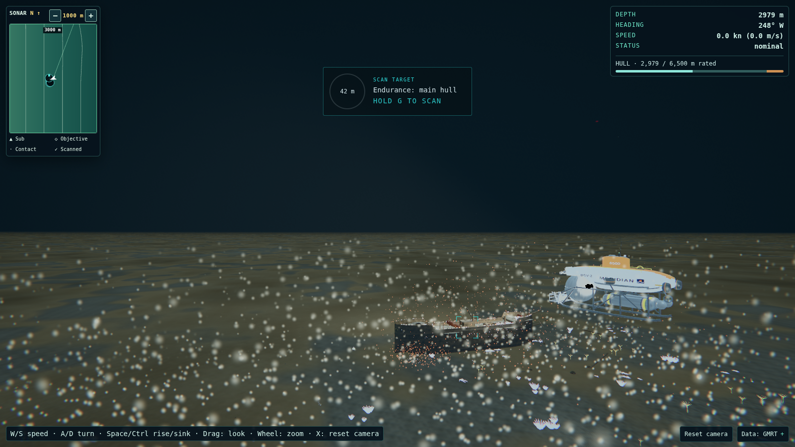
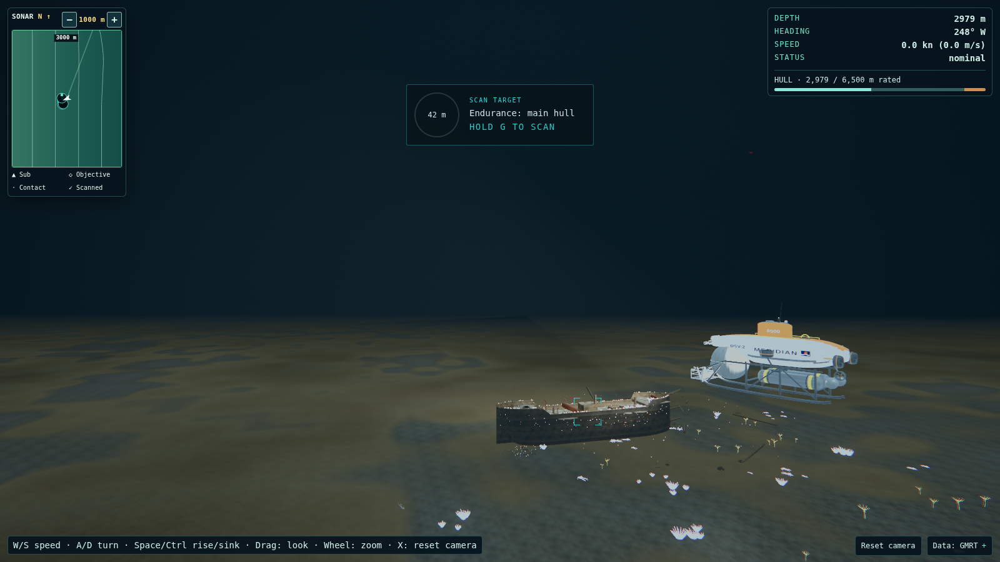
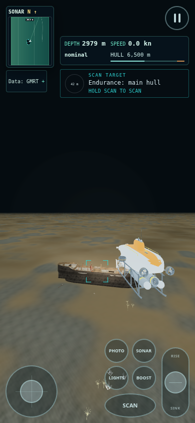

# 1180 — Endurance first-frame snow, hull artefact and horizon

Plan: inspect the reported opening and reproduce desktop/portrait goldens; tune only Endurance's snow and wreck atmosphere; trace the black hull patch at every quality tier; match Titanic's abyssal horizon treatment; perform two validation rounds and run `tools/gates.sh --full-e2e`. Preserve assertions and update only intentionally changed expectations.

## Changes

- Endurance permanent snow admission falls from 0.25 to 0.12. The existing MarineSnow shader already caps permanent sprites at 3 px, so its shared size, opacity and other-site rendering remain unchanged.
- Endurance wreck haze falls from 9,000 to 1,500 particles at High, from 1.1 to 0.08 m sprite size, and from 0.22 to 0.075 opacity. Rust motes fall from 700 to 100 per eligible hull, from 0.35 to 0.04 m, and from 0.5 to 0.12 opacity. Both layers now have Endurance-only ceilings of 2 px and 0.75 linear brightness throughout their field. The previous foreground guard allowed broad, very bright sprites beyond 12 m; the preset's ambient coupling magnified these discs under Endurance's intensity-20 fill.
- WreckPreset opts into this local configuration when the loaded POIs contain `endurance-hull`. Other wrecks retain their particle settings and limits. Low retains its existing absence of wreck particles.
- Endurance uses the existing TitanicHorizon implementation, named `enduranceHorizon`, including its fog-matched lower hemisphere, dim blue-grey upper gradient, 700–1,200 m activation and Low-tier path. Endurance's terrain receives Titanic's 110–650 m abyssal distance blend into the same fog colour. Existing nearby light and ambient intensities are preserved. Lost City, Blue Hole and Beebe geometry were not edited.
- A raycast using the reported desktop manifest places the black patch (pixel 1186,577) on `vehicle-metal`, on the crew sphere at local approximately `[-0.457,-0.345,-1.488]`, rather than on the decal mesh. The hull highlight shoulder used an unbounded `tanh` argument. Large positive exponentials in GPU implementations can yield NaN under close bright lamps, consistent with the abrupt pure-black patch on otherwise pale metal. The shader now uses the equivalent negative-exponential expression, whose exponent cannot overflow. This numerical fix applies to lit hull materials at all tiers; normal-range colour is mathematically preserved. The subsequent external full-suite run passed the reported sphere-pixel check at all four tiers. Its desktop captures were opened and inspected: the black patch is absent at Low, Medium, High and Ultra.

## Before / after evidence

Fresh captures were attempted before and after with:

```bash
GATES_CONFIG_MODE=writable GOLDEN_SITES=endurance \
  GOLDEN_LAYOUTS=desktop,portrait tools/golden.sh
```

Both writable-config builds succeeded, but preview startup was denied with `listen EPERM: operation not permitted 127.0.0.1:4298`. The connected browser runtime also reports no available browsers. The later external E2E run supplied a desktop after capture, now paired below with the reported desktop golden. This sandbox still cannot produce new captures. The initial default-config attempt additionally hit read-only `node_modules/.vite-temp`; the repository's documented writable-config option resolved that build limitation. Logs: `.cache/1180/golden-before.log`, `.cache/1180/golden-after.log`.

| View                   | Before reference                                                                                       | After                                        |
| ---------------------- | ------------------------------------------------------------------------------------------------------ | -------------------------------------------- |
| Desktop 1600×900, High | Exact reported golden, 2026-10-09-195308; inspected locally                                            | External High desktop E2E capture; inspected |
| Portrait 390×844, Low  | Archival 2026-10-09-034952; inspected locally; different tier and earlier build, not a paired baseline | Capture blocked by preview bind policy       |







References were copied unchanged from `/home/vijay/submarine-explorer/.cache/golden/<stamp>/`; their original manifests are retained at `.cache/1180/before-desktop-poses.json` and `.cache/1180/reference-portrait-poses.json`. SHA-256 comparisons confirm both image copies are byte-identical to their originals (`.cache/1180/reference-provenance.json`). The Low portrait reference has no large sediment discs, as expected from the disabled wreck layers; both references show a hard seabed edge. Desktop shows dense white sediment and the black sphere patch. The desktop after is copied unchanged from `test-results-gates-4372-1186766/f-endurance-1180-Endurance-5ae46--finite-and-horizon-renders-chromium/endurance-high-desktop.png`. It shows the wreck clearly, fine sediment, no black hull patch, and the softened far seabed. The E2E viewport-resize portrait image was also opened, but it shows an unpresented/blank scene with desktop HUD sizing; it is not a usable portrait golden. Fresh `GOLDEN_SITES=endurance GOLDEN_LAYOUTS=desktop,portrait` captures are still needed outside this sandbox.

## Validation

Round 1 identified the dominant sediment source and the metal-sphere location. The initial focused tests caught nine shader-string expectations affected by replacing the fixed 256 px far ceiling with a uniform. Initial gates also caught incomplete typed frame fixtures, the old Endurance 0.25 snow-density expectation, and the intentional terrain-fade snapshot change. Both were corrected without removing assertions. Existing non-Endurance expectations still assert a 256 px ceiling; Endurance expectations assert the intentional 2 px/0.75 brightness limits.

Round 2 adds Endurance headless coverage for Low, Medium, High and Ultra: preset counts, sizes, opacity, GPU uniform wiring, near/far appearance limits, fog-matched backdrop, terrain fade, shallow-depth deactivation, disposal, and generic-wreck isolation. Hull tests evaluate the actual injected shader shoulder expressions with float rounding through intensities up to 1e20, asserting finite positive channels and agreement with the prior mathematical shoulder. The first focused run passed 17 tests.

`tests/e2e/f-endurance-1180.spec.ts` adds a browser regression at all four tiers. It reads the reported sphere location immediately after a direct render, checks against black pixels, checks the backdrop and shader errors, and saves desktop and portrait screenshots. This test is included in the full gate suite; execution status is recorded below. A separate launch with web-server debug logging confirmed both IPv4 and IPv6 connections are rejected with `connect EPERM` (`.cache/1180/e2e-tier-check.log`).

Initial sandbox gate command: `GATES_CONFIG_MODE=writable PW_PORT=4180 PW_OUTDIR=dist-1180 tools/gates.sh --full-e2e`.

| Gate                      | Initial sandbox result                                              |
| ------------------------- | ------------------------------------------------------------------- |
| Config / production build | PASS                                                                |
| Unit                      | PASS — 164 files, 1,633 tests                                       |
| Python                    | PASS                                                                |
| Strict content            | PASS                                                                |
| Attribution               | PASS                                                                |
| Prettier                  | PASS                                                                |
| Full E2E                  | BLOCKED — preview server could not start; no browser tests executed |
| Project-base E2E          | BLOCKED — base build passed, preview server could not start         |

The script exits 1 because of the two browser launch failures. It is not a full gate pass. Initial sandbox logs: `.cache/1180/gates.log`, `.cache/gates/{build,unit,python,content,attribution,prettier,e2e,e2e-base}.log`. Round-1 failures are preserved at `.cache/1180/gates-round1.log` and `.cache/1180/unit-gates-round1.log`; the final run supersedes their build/unit failures. The four new browser tests originally loaded with Playwright's `--list` (`.cache/1180/e2e-tier-list.log`); the later external run executed and passed all four. Final source whitespace check also passes.

The Beebe isolation snapshot was updated only for Endurance's intentional biome/fog uniforms, terrain shader and program cache entries at Low and High. All geometry buffer hashes and every other site's snapshot entries are unchanged. No image snapshots were updated. Portrait visual acceptance remains pending: check that the whole wreck reads within 10 seconds, particles remain fine flecks in both layouts, the sphere is clear of black artefacts at all four tiers, and distant seabed blends continuously into upper water without losing near wreck contrast.

To reproduce outside the restricted bind environment:

```bash
GATES_CONFIG_MODE=writable PW_PORT=4180 PW_OUTDIR=dist-1180 \
  tools/gates.sh --full-e2e
GATES_CONFIG_MODE=writable GOLDEN_SITES=endurance \
  GOLDEN_LAYOUTS=desktop,portrait tools/golden.sh
# Repeat the golden command with GOLDEN_TIER=low, medium and ultra for tier review.
```

## External gate follow-up — phone tutorial clearance

The orchestrator's `tools/gates.sh --full-e2e` run outside the sandbox passed build, unit, Python, strict content, attribution, Prettier and project-base E2E. Full E2E recorded 568 passed, 49 skipped, and five failures. All four Endurance tier regressions passed. The five failures in `f-bughunt-15`, `f-toast-placement` and `f-touch-audit` share the same tutorial/control overlap at 390×844 and 150% UI. The external log is preserved at `.cache/1180/e2e-orchestrator-before-ui-fix.log`.

Root cause: the phone tutorial used a fixed 176 px bottom offset while the control grid scales with UI preference and available width. The failing trace places the tutorial at y=612–668, the button cluster at y=632.578–828.094, and the slider at y=646.203–828.094. This is a real overlap, independent of animation or timing.

Fix: `touch.css` exposes the existing portrait width cap as a shared CSS length. The portrait-phone tutorial in `hud-layout.css` now docks above three 52-unit rows, two 8-unit gaps and the 14-unit bottom edge, with an 8 px separation. A 176 px minimum accounts for the controls' 48 px row floors. Both elements use the same UI scale and width cap, so changing preference or viewport recomputes the gap. Short-phone and landscape rules retain their prior placement. No test assertions, timeouts, snapshots or touch-target sizes were changed for this follow-up.

At the reported 390 px width, the effective control scale is 382/336 ≈ 1.1369. The new bottom offset is approximately 219.46 px; the tutorial bottom becomes y≈624.54, giving approximately 8.04 px clearance to the trace's button top. The numerical audit is retained at `.cache/1180/tutorial-clearance-audit.json`; this is calculated evidence, not a new browser measurement.

Follow-up local static gate command: `GATES_CONFIG_MODE=writable PW_PORT=4180 PW_OUTDIR=dist-1180 tools/gates.sh --no-e2e`.

Follow-up result: PASS — config/build, all 1,633 unit tests in 164 files, 148 Python tests, strict content, attribution and Prettier. Log: `.cache/1180/gates-ui-fix.log`. Production CSS also contains both the shared width cap and the new tutorial clearance expression; `git diff --check` passes. The five failing browser cases require an external rerun; this sandbox cannot start Vite or Chromium. Suggested focused command against a fresh external build:

```bash
PW_PORT=4372 PW_OUTDIR=dist-1180 npm run test:e2e -- \
  tests/e2e/f-bughunt-15.spec.ts tests/e2e/f-toast-placement.spec.ts \
  tests/e2e/f-touch-audit.spec.ts
```

Then rerun `tools/gates.sh --full-e2e` outside the sandbox. The report does not claim a passing full browser gate for the clearance fix until that rerun completes.
