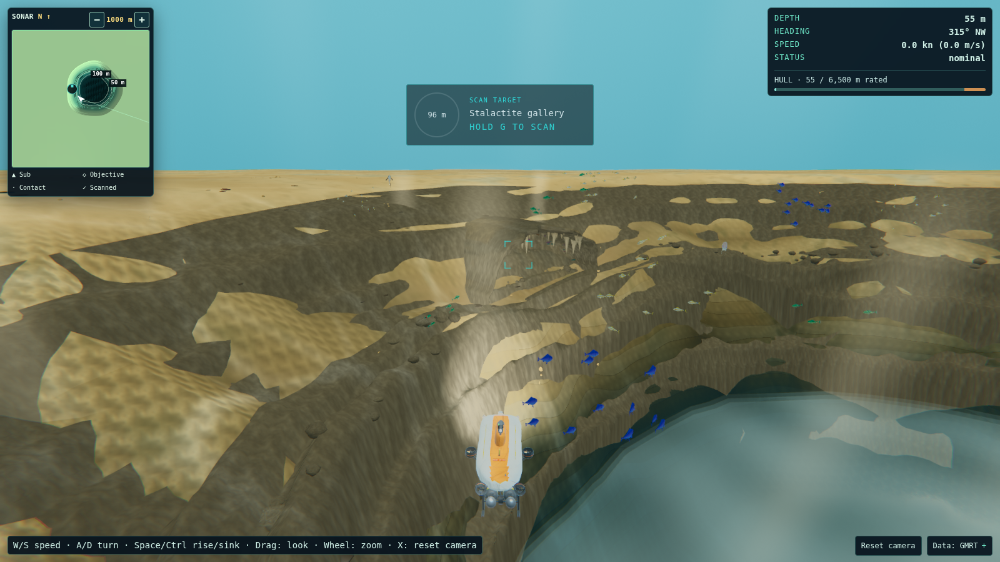
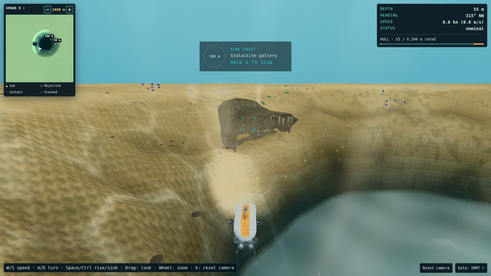
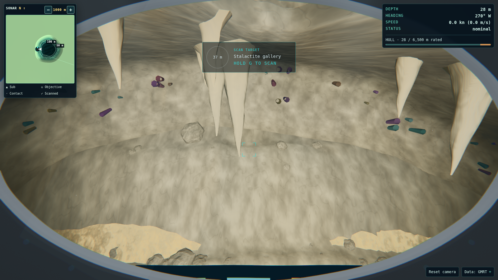
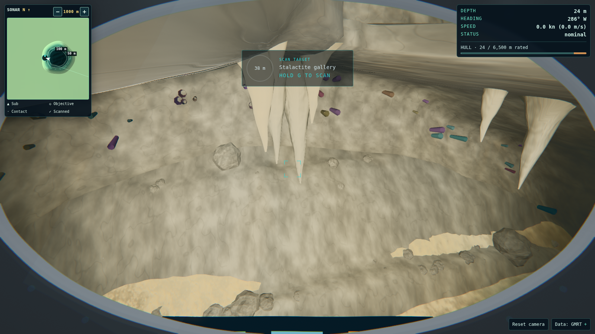
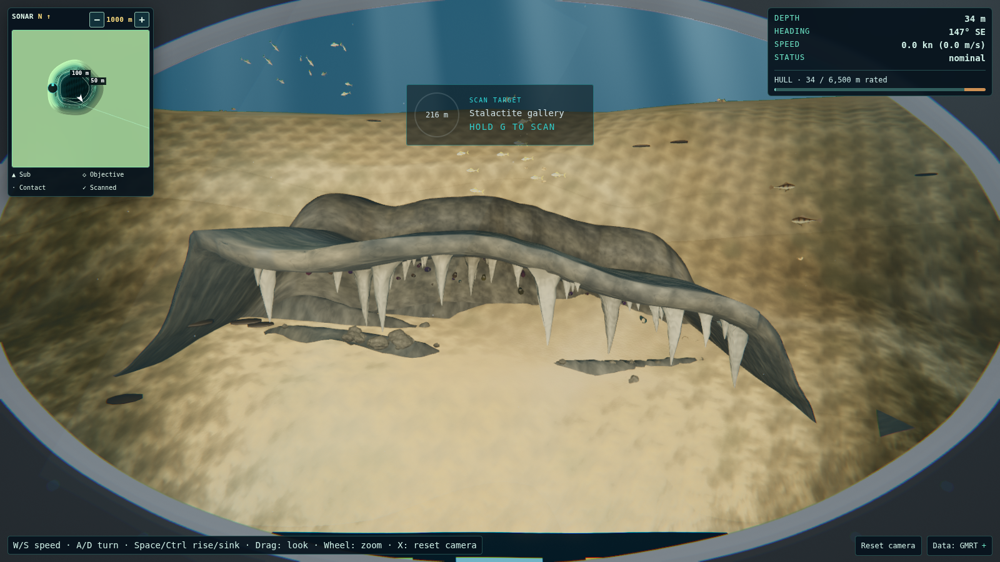
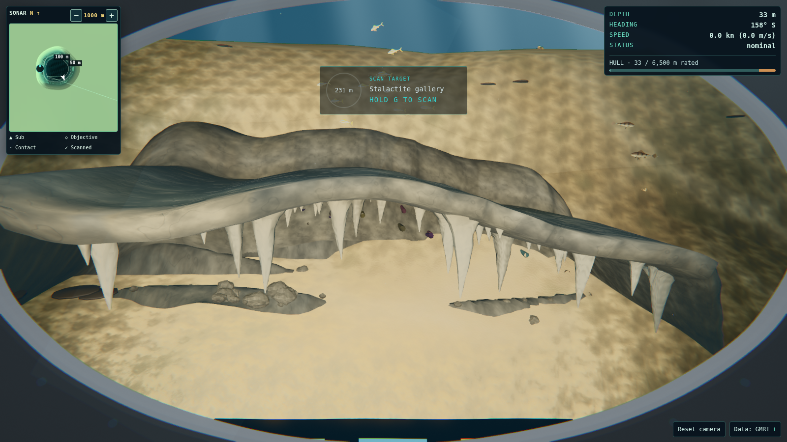

# 910 — Blue Hole wall relief redo

Started from main `ff44602`, with 830 reverted. Implementation and three geometry
review rounds are complete; **visual acceptance is pending**. The requested
`tools/golden.sh` command was attempted before and after, but this sandbox refuses
localhost preview listeners. Chromium also cannot launch, and the browser runtime
reports no available browser. There are **no 910 after PNGs or new portrait PNGs**.
The images below are the director's historical desktop captures, copied into this
change and personally inspected. Numeric geometry checks are not pixel QA.

## Change

The wall's ledges, solution flutes and rubble hummocks now displace the existing
Blue Hole terrain carve. They share its triangles, sediment/rock material,
continuous colour and normal blending, and collision heights. There is no extra
annular rock prop: the differently tessellated brown skin that crossed the sand
in 830 has been removed from this approach. Relief fades to zero at the reef,
floor and both gallery seats. The relief recipe adapts the sound ledge/flute
idea from 830's `blueHoleWall.ts`, through the fidelity mechanism added in 810.

A Blue Hole-only fidelity entry refines six local patches on Medium and above.
Medium uses 16 subdivisions per survey cell (about 3.65 × 3.82 m); High/Ultra
use 32 (about 1.82 × 1.91 m). Eight-cell patches avoid the excessive draw count
of the first four-cell patch allocation. Distant terrain uses subdivision 2.
Low retains its existing coarse geometry allocation; fine fluting is consequently
under-resolved there. The shaft remains a heightfield; actual overhangs belong
to the two gallery meshes.

Only 830's lower upper-wall PROFILE is reused in the galleries. The rear crest
returns under the rising wall instead of standing above the roof. Main's gallery
dimensions, shelf scalloping/projection, pendant generation and lighting remain.
In particular, the west shelf retains `0.42 + 0.95 * scallop`; 830's reduction to
`0.42 + 0.35 * scallop` is not reused. On level seating, pendant envelopes match
main exactly at Low and High. The central west roof drops from 15.93 to 13.17 m
on Low and 16.77 to 13.19 m on High, without shrinking the pendants. Collider
sampling increases from eight to twelve strips to cover the lower rear roof.

770's spawn settings, scan contact and opening test file are unchanged. Actual
first-target distances are 99.84 m Low, 100.11 m Medium, 100.18 m High and
100.22 m Ultra. Other sites' snapshot evidence remains unchanged; only the Blue
Hole High fields were refreshed in the multi-site isolation snapshot. Shared
engine files contain only the Blue Hole profile/geometry changes.

## Images and honest patchiness review

Source directories in the main checkout:
`.cache/golden/2026-10-08-132228` (830) and
`.cache/golden/2026-10-08-132858` (830 reverted). The originals were absent in this
worktree, but present under `/home/vijay/submarine-explorer`.

The rejected opening has large, hard-edged sand islands across brown rock on
most of the shaft. This is severe intersection patchiness, not convincing
sediment coverage. The reverted opening is clean across the slope and has a
readable gallery, with a conspicuous raised crest. Its close gallery views still
have a few hard sand/prop intersections at the apron. Those original gallery
seams are not claimed fixed by this wall change. The east baseline retains a
broad pendant span and an exposed roof crest. Both reviewers inspected the
historical opening, west approach/detail and east approach/detail images.

**910 patchiness cannot yet be judged visually.** One shared terrain surface
removes the known wall-skin intersection mechanism, but that does not establish
that the final slope, gallery seams or material transitions look good. West
approach/detail cameras aim at the prop's computed bounds centre, which moves
when the crest is lowered: the CPU audit finds less pendant-vertex coverage in
those desktop frames (about 44–45% before versus 39% after). Portrait west close
coverage is unchanged; east coverage is unchanged. These observations need
PNG review, including whether the lower roof improves the actual composition.
The opening pendant footprint is slightly wider and taller than main, and all
opening pendant vertices remain framed in desktop and portrait.

Rejected 830 opening:



| Required pose | Before: clean 132858 desktop                                       | 910 after       |
| ------------- | ------------------------------------------------------------------ | --------------- |
| Opening / rim |             | Pending capture |
| West approach |       | Pending capture |
| West detail   |         | Pending capture |
| East approach |  | Pending capture |
| East detail   |    | Pending capture |

Portrait before/after images also remain pending. No substitute render or
historical image has been labelled as an after capture.

## Three rounds

1. Compared 830 against current main and inspected the director's opening PNGs.
   Kept the full shelf/pendant footprint, lowered only the crest, and integrated
   the relief into the heightfield. All 11 existing Blue Hole-focused tests passed.
2. Reviewed the shared material and actual terrain triangles, added regression
   checks for pendant extent, roof lowering, relief continuity, local allocation
   and physics/triangle agreement. The broader suite exposed insufficient rear
   roof collider coverage; twelve strips fix it without weakening assertions.
   The Blue Hole High isolation snapshot was updated, with other sites untouched.
3. Audited all five golden poses at desktop/portrait and all four tiers, added
   High opening size/terrain-visibility checks, and reduced patch fragmentation
   from four to eight source cells. Final focused suite: 15 tests pass, including
   the untouched 770 opening tests. No fresh screenshot review was possible.

## Geometry evidence

[Full before/after CPU audit](F-BLUEHOLE-910/geometry.json) covers real bathymetry,
placed gallery meshes, composed Arcade opening and the golden camera construction.
Counts are **terrain CPU allocation/frustum counts**, not measured GPU allocation,
renderer.info totals or timing. They exclude props, swimming life, the sub and
postprocessing. Terrain-ray samples test terrain occlusion only, not roof/HUD
occlusion or visual legibility. The JSON uses the final eight-cell patches.

| Tier   | Resident vertices before → after | Chunks before → after | First scan after |
| ------ | -------------------------------: | --------------------: | ---------------: |
| Low    |                343,476 → 343,476 |               81 → 81 |          99.84 m |
| Medium |            1,312,263 → 1,418,754 |              81 → 144 |         100.11 m |
| High   |            2,906,766 → 1,718,274 |              81 → 144 |         100.18 m |
| Ultra  |            2,906,766 → 1,718,274 |              81 → 144 |         100.22 m |

High opening desktop terrain increases from 25 draws / 476,928 triangles to
36 / 719,360; portrait increases from 21 / 456,960 to 31 / 709,504. Across all
High poses the maxima are 66 draws and 737,156 terrain triangles. Medium's
maximum is 66 draws / 256,772 triangles. These remain within resident allocation
limits, but browser frame budgets and timing still require measurement.

The High opening's projected pendant span in normalized device coordinates:
desktop 0.186812 × 0.098629 before, 0.186924 × 0.099711 after; portrait
0.332110 × 0.045575 before, 0.332310 × 0.046075 after. Every opening pendant vertex
is on-screen. Sampled terrain visibility rays are clear at all five poses in both
layouts. These checks protect gallery scale and seating; they cannot certify
rendered sand blending, new ledge visibility or aesthetic quality.

To reproduce the CPU comparison from a checkout with main at the baseline:

```sh
mkdir -p .cache/blue-hole-910
git show main:src/core/config/terrain.ts > .cache/blue-hole-910/main-terrain.ts
git show main:src/world/terrainFeatures.ts > .cache/blue-hole-910/main-terrainFeatures.ts
git show main:src/world/props/geo/stalactites.ts > .cache/blue-hole-910/main-stalactites.ts
node tools/blue-hole-geometry.mjs
```

## Validation and required browser follow-up

Production build/typecheck, focused geometry tests and diff checks pass. The
final full static gate results are recorded below once the run finishes.
Full-suite and project-base E2E are attempted through the repository gate script;
preview startup is blocked, so browser assertions cannot execute here.

Golden commands attempted before and after:

```sh
GOLDEN_SITES=great-blue-hole GOLDEN_LAYOUTS=desktop,portrait tools/golden.sh
GATES_CONFIG_MODE=writable GOLDEN_SITES=great-blue-hole GOLDEN_LAYOUTS=desktop,portrait tools/golden.sh
```

The first command hits read-only `node_modules/.vite-temp`; the repository's
writable-config mode fixes that and completes the production build, then fails
with `listen EPERM: operation not permitted 127.0.0.1:4298`. A direct Chromium
launch also fails at `sandbox_host_linux.cc:41`, `shutdown: Operation not permitted`.
The installed browser runtime was checked and has no connected browsers.

Evidence logs: `.cache/910-before-golden.log`, `.cache/910-after-golden.log`,
`.cache/910-final-gates.log` and `.cache/gates/`. The retained final build is
`dist-910/`; a matched main build is `dist-910-before/`.

On a browser-capable runner, capture main and this branch with the same current
script and both layouts, add all ten matched before/after pairs here, and inspect
opening scale, sand/rock transitions, west bound-centre framing, gallery/apron
seams, ledges/fluting/rubble from inside the shaft, and both east poses. Run full
E2E and measure actual per-tier renderer counts. **Do not treat this note as a
visual sign-off or merge acceptance.**
