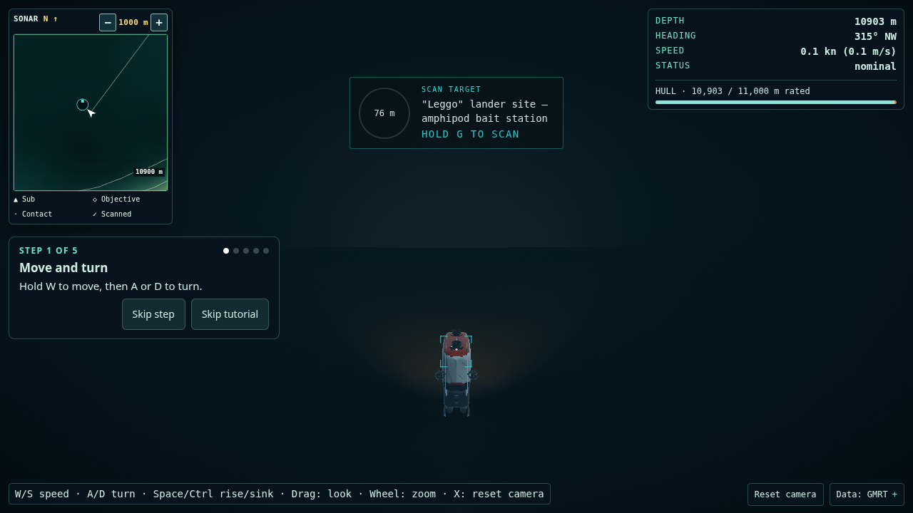
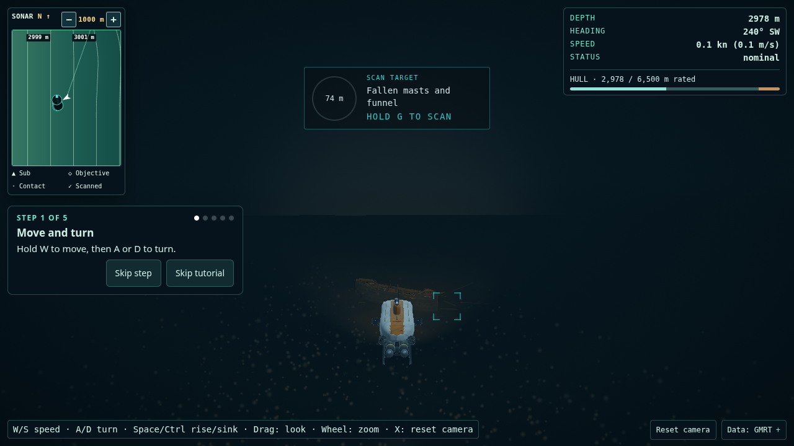

# F-GOLDEN-950 — Challenger Deep and Endurance opening

2026-10-08. External full E2E found one Endurance facing failure. The local
follow-up reduces the heading offset and moves the camera sideways, retaining
the phone-reticle assertion. The new regression reproduces the exact external
failure before the fix and passes afterward. Post-fix build, all 1,545 unit
tests and every static gate pass. External E2E rerun and fresh golden pairs
remain pending.

## Findings and changes

The retained desktop first frames below were inspected directly. Challenger
shows a barely distinguishable floor and no readable sampling cue; Endurance's
hull is almost swallowed by fog. Both shots also contain an older tutorial HUD,
so they are references, not fresh baseline captures.

- Challenger: shorten the opening from 65 to 34 m beyond the sampling marker's
  footprint; request 8 m altitude (the safety clearance takes precedence), 8°
  heading offset, and a 48 m chase radius with lateral/vertical offsets
  −28/−10 m. A closer 24 m candidate failed the first scan's vertical angle;
  34 m retains scan access without pitching the sub into the floor.
- Endurance: shorten the opening from 70 to 32 m beyond the hull footprint;
  request 14 m altitude, 8° heading offset, and a 52 m chase radius with
  lateral/vertical offsets −38/−10 m. Retain the existing 44 m wooden wreck,
  original coordinates, deck gear, fallen rigging and stern lettering.
- Give only these two sites a copy of the abyss depth band: neutral ambient
  tint `0x879399`, intensity 18 / 20, fog density 0.012 / 0.015, and vignette
  0.32 / 0.34 (Challenger / Endurance). Keep preset processing: High Challenger
  still applies the hadal 1.5× fog and 0.55× ambient multipliers. The baseline
  ambient was 0.18, with fog density 0.05. Upper-column depth-band values and
  other sites' atmosphere objects remain unchanged.
- Add a modest hemisphere fill (intensity 3) to each site and reuse the
  existing submarine lamp tuning: 2× spot intensity, 3× local point-fill
  intensity and 1.5× point-fill distance. Keep spot reach, cone opacity,
  falloff and ROV work-light behavior. This is authored exposure at depth;
  the abyss's sun intensity remains zero. No extra shadow map or light-volume
  mesh is introduced.
- Challenger stages one existing hadal-amphipod group near the opening's
  sampling approach (12 on Low, 18 elsewhere). Endurance stages one existing
  anemone group (5 / 8), raycast onto actual forecastle timber. Placement
  respects the current species table, depth bands, tier reach and agent pool.
  It declines remote starts and unsafe floor patches. All animals then use
  normal steering, scans and reset behavior; `?life=0` still disables life.
- The Journal already deduplicates each species and labels staged wildlife
  **Game addition** once per wildlife entry. Tests pin that behavior for both
  groups. No extra caveats or new species claims were added. Existing
  Challenger hadal-life guide sources and Endurance wreck notes supply the
  factual context; the recovered Leggo lander is still a historic-event marker,
  not a new permanent lander or reef at full ocean depth.
- Add both sites to `tools/golden-shots.mjs`, retaining the existing opening,
  approach and detail capture workflow. No Blue Hole, Beebe, Monterey or Lost
  City content/art files were changed. Shared integration changes are site-keyed.
  `DeepOpeningSpawn.ts` wraps the
  original bearing search and rechecks the shorter hull/camera clearance,
  falling back if unsafe. `Spawn.ts` and Beebe's isolation snapshots remain
  byte-identical; mission and free-dive integration both use this wrapper.

## Before/after pairs

Requested canonical first-frame pairs: desktop 1600×900, portrait 390×844,
High, tutorial off, `lifeSeed=42`, free-dive opening. Before and final golden attempts built
successfully but failed to bind preview port 4298 (`EPERM`). Direct capture
attempts then failed at Chromium startup (`sandbox_host_linux.cc`,
`shutdown: Operation not permitted`). Browser skill recovery found no connected
browser (`[]`). There are zero fresh images, so the after slots remain explicit
pending work rather than relabelled references.

| Site            | Layout / pose | Fresh before | Fresh after |
| --------------- | ------------- | ------------ | ----------- |
| Challenger Deep | Desktop / 1   | Blocked      | Blocked     |
| Challenger Deep | Portrait / 1  | Blocked      | Blocked     |
| Endurance       | Desktop / 1   | Blocked      | Blocked     |
| Endurance       | Portrait / 1  | Blocked      | Blocked     |

The same capture attempts also planned approach/detail poses 2 and 3 in both
layouts; none were captured. Evidence:

- [Before manifest](../../.cache/golden/2026-10-08-211735/poses.json) and
  [contact sheet](../../.cache/golden/2026-10-08-211735/index.html).
- [After manifest](../../.cache/golden/2026-10-08-212850/poses.json) and
  [contact sheet](../../.cache/golden/2026-10-08-212850/index.html).
- [Before preview failure](../../.cache/golden-950/before-preview.log),
  [after golden failure](../../.cache/golden-950/after-golden.log),
  [before capture log](../../.cache/golden-950/before-capture.log),
  [after capture log](../../.cache/golden-950/after-capture.log).
- The original successful build and site data are saved under
  `.cache/golden-950/before/` for a future exact baseline capture.

Retained desktop references (1280×720), copied without alteration from
`.cache/codex/shots/f-visual-qa/`:

| Site            | Retained before reference                                                     | Fresh after            |
| --------------- | ----------------------------------------------------------------------------- | ---------------------- |
| Challenger Deep |  | Pending browser access |
| Endurance       |         | Pending browser access |

## Validation

The following two full local attempts preceded the external facing follow-up.

`tests/unit/deepOpening.test.ts`: nine real-tile checks covering Low, Medium,
High and Ultra, plus atmosphere isolation. They check a collision-free spawn,
whole-sub and target fit at 1600×900, 1280×720 and 390×844, wildlife sightlines, actual
forecastle attachment, scanner completion through 10 s, species/depth budgets,
clear/repopulate, remote-start rejection and one Journal tag per staged species.
Mission and free-dive openings agree. These are geometry/simulation checks;
they do not render pixels or validate HUD occlusion. The atmosphere check verifies nonzero fog transmission at 80 m,
zero abyss sunlight and no mutation of the global config.

- Discovery gate run: static gates passed; unit checks exposed the Endurance
  phone-reticle overlap and shared spawn-source isolation failure. Both were
  fixed without changing protected files or test assertions. E2E and
  project-base E2E could not start their preview servers.
- An unrestricted-worker repeat timed out in five existing hero-integrity,
  marine-snow and Monterey tests under CPU contention. Final repeats set
  `VITEST_MAX_WORKERS=2`; assertions and timeouts remain unchanged. Logs:
  `.cache/golden-950/gates-parallel-timeouts/`.
- First final full gate run: **153 unit files / 1,545 tests passed**. Build,
  Python, strict content, attribution and Prettier passed. Full E2E and
  project-base E2E failed before running tests: sandbox loopback connections
  returned `EPERM` and the owned preview server could not start.
  [Summary log](../../.cache/golden-950/gates-final1.log),
  [unit log](../../.cache/golden-950/gates-final1/unit.log),
  [E2E diagnostic log](../../.cache/golden-950/gates-final1/e2e.log),
  [project-base log](../../.cache/golden-950/gates-final1/e2e-base.log).
- Second final full gate run: **153 unit files / 1,545 tests passed** again.
  Build, Python, strict content, attribution and Prettier passed again. Both
  E2E suites hit the same preview/loopback `EPERM` restriction before testing.
  [Summary log](../../.cache/golden-950/gates-final2.log),
  [unit log](../../.cache/golden-950/gates-final2/unit.log),
  [E2E diagnostic log](../../.cache/golden-950/gates-final2/e2e.log),
  [project-base log](../../.cache/golden-950/gates-final2/e2e-base.log).

The two final commands were
`VITEST_MAX_WORKERS=2 DEBUG=pw:webserver GATES_CONFIG_MODE=writable tools/gates.sh --full-e2e`.
`writable` keeps Vite/Vitest config bundles out of the read-only shared dependency
tree; debug logging records the browser-server failure without altering tests.
These original local attempts could not execute E2E. The external run below
subsequently exercised both browser suites.

## External gate follow-up — Endurance facing

The orchestrator ran `tools/gates.sh --full-e2e` outside the sandbox: build,
unit, Python, content, attribution, Prettier and project-base E2E passed;
full E2E reported **439 passed, 49 skipped, 1 failed**. The sole failure was
`tests/e2e/f-visual-fixes.spec.ts:106`, Endurance opening facing:
`0.9612616959383189` against the unchanged `> 0.98` requirement.

Root cause: Endurance's 16° authored heading offset yields exactly
`cos(16°) = 0.9612616959383189`. That earlier offset cleared the phone reticle
by turning the submarine too far away from the wreck. The corrected opening
uses 8° (`cos(8°) ≈ 0.990268`) and changes only the lateral chase offset
from −26 to −38 m to preserve separation from the sub. The range, altitude,
chase radius, lighting, wildlife, protected site files and browser assertions
remain unchanged. No content was cut.

The unit regression now checks the browser's exact facing threshold for both
sites at every tier, alongside the existing whole-hull fit, 8 px reticle
breathing room, first scan and wildlife sightlines. It also checks the failing
browser viewport, 1280×720. Before the tuning change, all four Endurance tiers
failed with the exact external dot product. Afterward, all nine opening tests
and both Beebe isolation tests passed.

- [Before regression log](../../.cache/golden-950/facing-fix/before.log).
- [After regression log](../../.cache/golden-950/facing-fix/after.log).
- Post-fix full local static gates: **passed** — build, all 153 unit files /
  1,545 tests, Python, strict content, attribution and Prettier. Command:
  `VITEST_MAX_WORKERS=2 GATES_CONFIG_MODE=writable tools/gates.sh --no-e2e`.
  [Summary log](../../.cache/golden-950/facing-fix/gates.log),
  [unit log](../../.cache/golden-950/facing-fix/static/unit.log).
- Post-fix external E2E rerun: pending; this sandbox cannot launch Vite or
  Chromium. The provided external gate result is recorded as pre-fix evidence,
  not a passing post-fix browser run.

## Still weak / required visual review

- Challenger intentionally remains a quiet silty plain; the three-metre
  historic marker and centimetre-scale animals may still read too small from
  chase view, especially on a phone. No giant animals, fish or invented wreck
  were added to compensate.
- Endurance's existing procedural timber and rail growth remain approximate;
  the opening cannot make the stern name legible from the bow-side approach.
- Neutral fill can flatten timber or wash the nearest silt; thinner fog may
  reveal a distant terrain edge. Check both in fresh rendered pairs before
  accepting the documentary look.
- Actual phone HUD fit, rendered Low-tier appearance, particle density,
  contrast and performance require a browser run. Headless projection fit is
  not phone visual acceptance.
